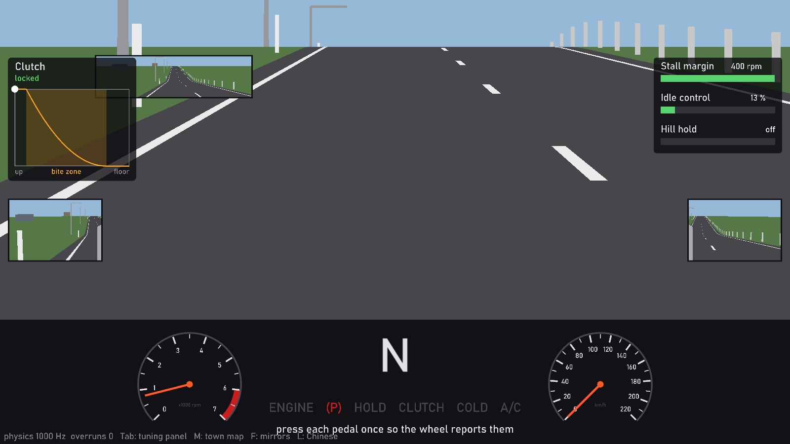
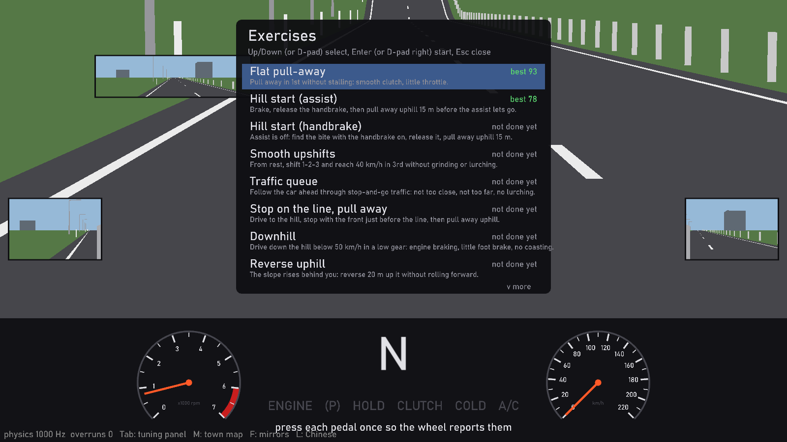
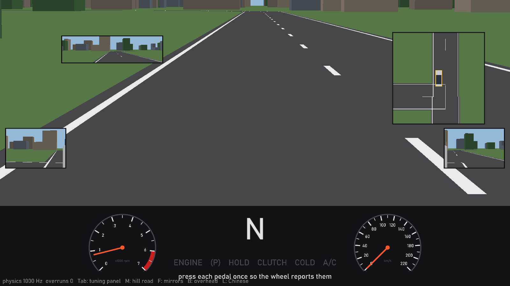
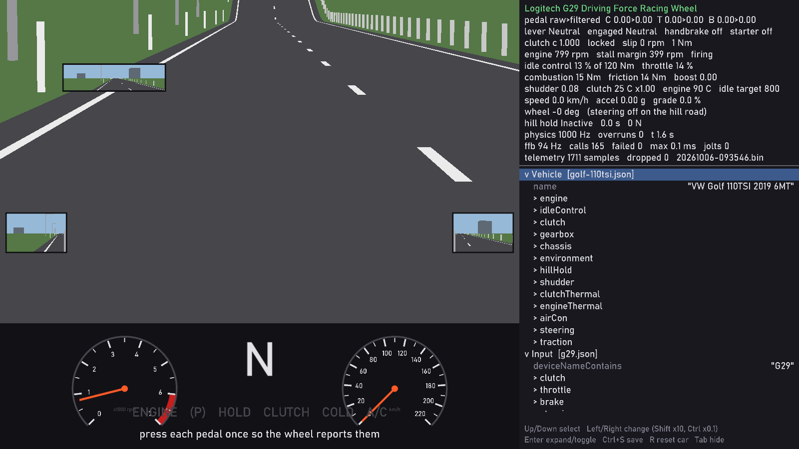

# Manual Sim

**A glass-box manual transmission trainer for the Logitech G29.** Clutch slip, transmitted torque, ECU idle compensation and distance-to-stall are all modelled, shown live, and replayed afterwards, so when you stall you can see *why*.

[中文](README.zh.md)



## Why

Existing driving games treat the clutch as a black box: you stall and never learn what happened. City Car Driving is forgiving and every car feels alike; BeamNG is mechanically accurate but has weak pedal feel; racing sims ignore pulling away and stalling.

Manual Sim is built around one car, a 2019 VW Golf 110TSI (1.4 L turbo, 6-speed), and the one skill that is hard to learn from a manual: coordinating clutch and throttle. Behaviour such as stalling, shudder, lugging and hill-start rollback is not scripted. It falls out of the physics.

## Features

- **Physics core at 1 kHz.** Turbo engine with boost lag, ECU idle compensation, clutch with bite zone and heat, driveline inertia, hills, hill-start assist, optional air-con load.
- **Real pedals and shifter.** Three independent analog pedals, the H-shifter (including reverse), handbrake and starter on the wheel. Gear grinding and over-revving have consequences.
- **Force feedback and sound.** Engine judder and gear grind through the wheel; engine, turbo whistle, starter and grind synthesised in real time from the same state.
- **Teaching mode.** Live clutch curve, stall margin, idle-control usage, hill-hold state and shift suggestions, plus coaching cues.
- **Graded exercises and exams.** Flat pull-away, hill starts (with and without assist), smooth upshifts, traffic queue, stop-on-the-line, downhill, reverse uphill and more. Each attempt gets a score, a grade and the single mistake that cost the most.
- **Ghost, replay and progress.** Every attempt is recorded at 1 kHz. Replay it, overlay your best run, and track trends across sessions.
- **Town driving.** Steer through a small town with a single-track tyre model, parking sensors and an overhead view.
- **Seven cars.** Golf 110TSI, small NA petrol, 2.0 diesel, Mustang GT, Civic Type R, GR86 and MX-5, each with its own engine, gearbox, tyres and sound.
- **Driver profiles and a leaderboard**, Chinese and English UI.
- **Live tuning panel.** Every parameter lives in `config/*.json` and can be changed while driving.

## Screenshots

| Exercises | Town and overhead view |
| --- | --- |
|  |  |



## Requirements

- Windows 10 or 11, 64-bit
- Logitech G29 with the H-shifter (PS3 mode, Logitech G HUB installed, 900° range, its own centring spring off)
- Speakers or headphones; the engine sound is part of clutch control

Other wheels are not supported yet. The physics and training libraries are platform-independent and build and test on Linux.

## Run it

**From a package.** Unzip `ManualSim.zip`, run `ManualSim.exe` and follow the first-time setup (screen size, viewing distance, speaker check). See [docs/install.en.md](docs/install.en.md).

**From source.** Needs the .NET 10 SDK.

```powershell
dotnet run --project src/Sim.App -c Release
```

Build a self-contained package with `pwsh scripts/publish.ps1`.

### Keys

| Key | Does | Key | Does |
| --- | --- | --- | --- |
| E | Exercises, exams, progress | T | Teaching mode |
| R / H | Restart / hill start | P | Replay |
| M | Hill road / town map | V | Choose the car |
| F | Mirrors | B | Overhead view |
| Tab | Tuning panel | L | Language |
| F11 | Full screen | Esc | Back / quit |

Start the engine with X on the wheel. Reverse is the shifter's seventh position.

## How it works

```
 G29 ──► Sim.Input ──┐
                     ▼
        Sim.Core  (1 kHz physics, no dependencies)
                     │  lock-free double buffer
      ┌──────────────┼──────────────┬──────────────┐
      ▼              ▼              ▼              ▼
   render         audio       force feedback   telemetry
   (raylib)     (callback)      (~100 Hz)      (recording)
```

| Project | Role |
| --- | --- |
| `Sim.Core` | Physics core: input struct in, state struct out, fixed 1 ms step. No SDL, raylib, IO, threads or clocks. |
| `Sim.Training` | Exercises, scoring, coaching cues, town map. Pure logic, same rules as the core. |
| `Sim.Input` | SDL3 joystick reader and haptic force feedback. |
| `Sim.App` | raylib host: rendering, audio synthesis, tuning panel, telemetry. |
| `tools/HwProbe` | Hardware probe for checking G29 axes, buttons and force feedback. |

The ground rules (physics emerges from the model, no magic numbers, tests are never weakened, physics never waits for rendering) are in [docs/engineering-rules.en.md](docs/engineering-rules.en.md).

## Tests

```powershell
dotnet test
```

Twenty acceptance tests (T1–T20) pin the car's behaviour: pull-away, stalling, hill starts, over-revving, traction. Thirteen scoring tests (S1–S13) pin how attempts are graded. They run on scripted pedal input and need no hardware.

## Documentation

| Doc | Content |
| --- | --- |
| [Design](docs/design.en.md) | Full specification, parameters, decision records per milestone |
| [Roadmap](docs/roadmap.en.md) | Milestones after v1 and their gates |
| [Install](docs/install.en.md) | Package install, G HUB settings, keys |
| [Engineering rules](docs/engineering-rules.en.md) | Stack, layout, hard rules, conventions |
| [HwProbe](tools/HwProbe/README.en.md) | Hardware probe usage |

Every document exists in English (`.en.md`) and Chinese (`.md`).

## License

[MIT](LICENSE)
