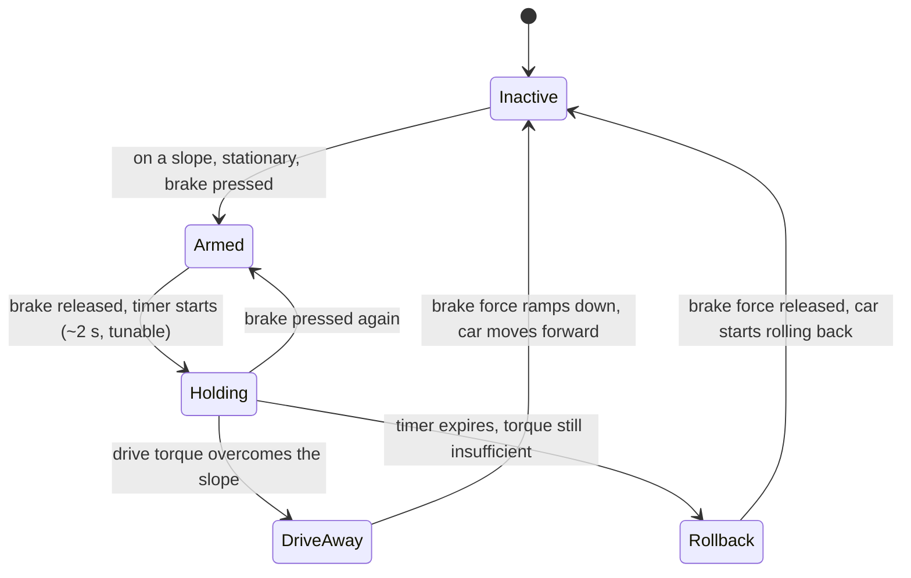
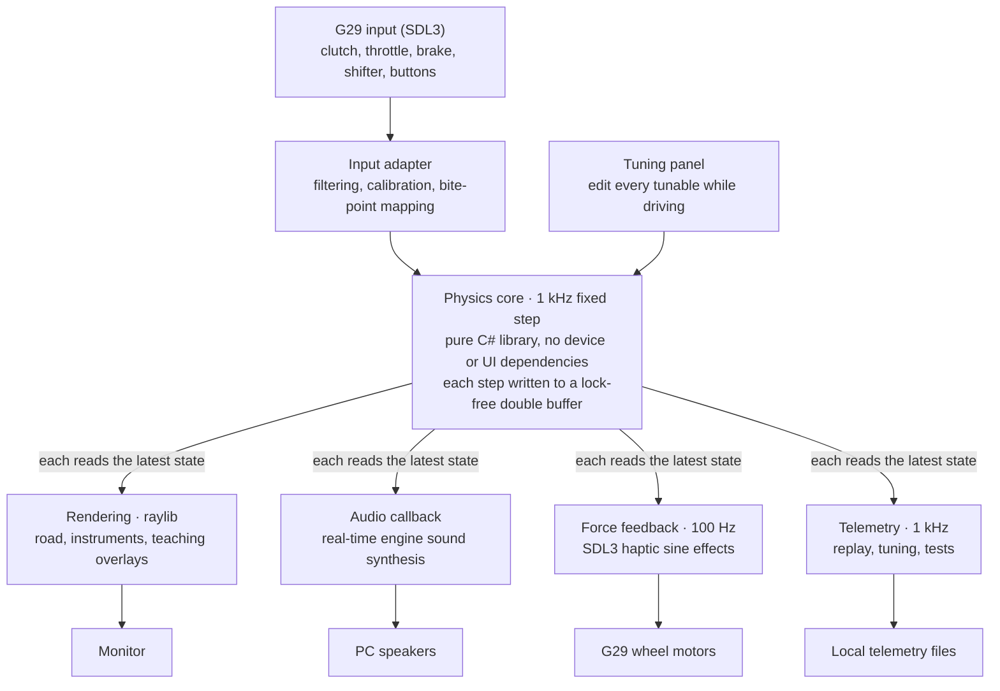

# Manual Transmission Practice Simulator v1 Design

2026-10-03 · Donghui

> English version of [`design.md`](design.md) (中文). The two files are kept in sync: every change goes into both in the same commit.

## Overview

The goal of v1: on my existing Logitech G29, reproduce the feel of my own 2019 VW Golf 110TSI manual — pulling away, hill starts, shifting, stalling and judder — to practise clutch and throttle coordination. For my own use first; others later once it matures.

Existing products are "black boxes": you stall, but you don't know why. City Car Driving's clutch is very forgiving and every car feels the same; BeamNG is mechanically accurate but has weak pedal feel; racing sims don't care about pulling away or stalling.

This project is a "glass box": clutch slip, transmitted torque, ECU compensation, how close you are to stalling — the model knows all of it, can show it live, and can replay it afterwards. That is the core difference from existing products.

## v1 scope

v1 is a straight road with an adjustable-grade uphill section and a stop line in the middle. Longitudinal control only.

| In | Out (later versions) |
| --- | --- |
| Flat pull-away, creeping, shifting, slowing down, stalling | Steering and lateral dynamics |
| Hill starts, including Golf hill-start assist (can be switched off) | Corners, intersections, traffic |
| Turbo lag and ECU idle compensation | Other car models |
| Consequences of mistakes such as gear grinding and over-revving | Real-car data logging (decided against) |
| Immersion / teaching modes, background telemetry and replay | Keyboard, gamepad or other input devices |
| Live tuning panel | Extra hardware (bass shakers etc.) |

The physics core is fully decoupled from input and output: it depends on no device or UI, so adding steering, new devices or porting to other platforms later needs no rewrite.

## Hardware and design constraints

Overall principle: v1 uses only the existing equipment; no design may depend on extra hardware.

| Device | Use | Known limits and mitigations |
| --- | --- | --- |
| G29 three pedals | Throttle, brake, clutch as three independent analog axes | Potentiometers, 8-bit (256 levels); the bite zone covers only ~50–75 levels, so low-pass filtering is required or quantisation steps cause fake judder |
| G29 wheel | No steering; force feedback only, for engine judder and gear grinding | Dual-motor gear drive; periodic effects through SDL3 haptics |
| H-shifter | 6 gears + reverse | Passive lever, cannot block your hand; see shift rules below |
| Wheel buttons | Handbrake, mode switch, replay | — |
| Single monitor | Road + instrument strip at the bottom | First-time setup asks for screen width and viewing distance and computes the FOV |
| Ordinary PC speakers | Synthesised engine sound | Cannot play the 27 Hz fundamental; compensated with harmonics and modulation; first-time setup runs a sweep calibration |

Driver setup: the G29's mode switch on the back must be set to PS3 (USB PID C24F; in the PS4 position it is C260 and the axes cannot be read). Install G HUB and turn off "Combined Pedals", otherwise the clutch cannot be read; turn off the centering spring so it does not mask force feedback. The G29 firmware maps the brake in two stages: the lower 70 % of travel is about twice as sensitive as the upper 30 %; brake logic must allow for this.

Optional later upgrade: read the pedal potentiometers directly with an Arduino for 10-bit resolution. Not in v1; first confirm whether 8 bits is really the bottleneck.

## Physics model

The model is three rotating parts coupled through the clutch, plus one boost state. Stalling, judder and lugging all emerge from the physics; there are no special rules. Fixed step, 1 kHz.

**Engine.** Crank speed is driven by combustion torque minus internal friction minus the torque taken by the clutch:

```latex
J_e \dot{\omega}_e = T_{comb}(\omega_e, u, B) - T_{fric}(\omega_e) - T_{clutch}
```

Below the stall threshold there is no combustion torque; above the fuel-cut speed the ECU cuts fuel. After a stall, the ignition key drives the starter motor (torque falls linearly with speed) to restart. Friction is high near 0 rpm, representing compression resistance, so a car stalled in gear on a hill does not roll.

**Turbo lag.** Combustion torque = naturally aspirated part + boost part; boost pressure B follows its target with a time constant. At pull-away speeds (1000–1300 rpm) B is close to 0 and the engine behaves like a 1.4-litre naturally aspirated engine — that is where "not very strong" comes from.

```latex
T_{comb} = T_{NA}(\omega_e, u) + B \cdot T_{boost}(\omega_e, u), \qquad \tau_B \dot{B} = B_{target}(\omega_e, u) - B
```

**ECU idle compensation.** A PI controller targeting idle speed; the effective throttle is u = max(throttle pedal, controller output), and the torque the controller may request is capped. Releasing the clutch slowly keeps the load within the cap and the car creeps away by itself; releasing it abruptly exceeds the cap and the speed falls through the stall threshold.

**Clutch.** Pedal position maps through the bite point and bite-zone width to engagement c (0–1), which sets the maximum transmissible torque. With a speed difference across it, the clutch slips and transmits friction torque; with equal speeds it locks and transmits the torque actually needed (up to its capacity).

```latex
T_{clutch} = \begin{cases} c \, T_{c,max} \cdot \mathrm{sign}(\omega_e - \omega_t) & \text{slipping} \\ \min(|T_{req}|, \, c \, T_{c,max}) & \text{locked} \end{cases}
```

**Vehicle.** Vehicle speed is driven by clutch torque multiplied through the gear ratios, minus aerodynamic drag, rolling resistance, the gravity component along the slope, and brake and hill-hold forces:

```latex
m \dot{v} = \frac{T_{clutch} \, i_g \, i_f \, \eta}{r} - F_{aero} - F_{roll} - m g \sin\theta - F_{brake} - F_{hold}
```

**Judder.** At low speed and high load, a pulsation at firing frequency (four-cylinder four-stroke: two firings per revolution) is added to combustion torque. Its amplitude grows with load and as speed falls, with random irregularity. The same pulsation drives sound, wheel force feedback and camera shake.

### Parameters

| Parameter | Initial value | Source |
| --- | --- | --- |
| Peak torque | 250 Nm @ 1500–3500 rpm | carsales.com.au |
| Peak power | 110 kW @ 5000–6000 rpm | carsales.com.au |
| Gear ratios 1–6 / reverse | 4.11 / 2.12 / 1.36 / 0.97 / 0.77 / 0.63 / 4.0 | TrueCar (US model; Australian model to be verified) |
| Final drive | 3.39 | TrueCar (US model) |
| Mass | ~1300 kg + driver | Approximate |
| Tyres | 205/55 R16, circumference ~1.99 m | Estimate; check the tyre sidewall |
| Idle speed | ~800 rpm | Estimate, tunable |
| Idle compensation torque cap | ~120 Nm | Originally 60 Nm. M1 finding: idle speed in first gear carries ~60 Nm·s of angular momentum; 60 Nm minus friction cannot sustain T1's 2 s clutch release; T1 passes only from ~100 Nm. Tunable |
| Redline start / fuel cut | 6000 / 6800 rpm | vwvortex forum, Mk7 1.4 TSI owners (thin red line from ~6000, limiter ~6800–6900); check my own tachometer |
| Clutch max torque | ~350 Nm | Estimate (~1.4× engine peak), tunable |
| Bite point, bite-zone width | — | Tunable, by feel |
| Turbo time constant, NA torque curve | — | Tunable, by feel |
| Engine inertia, stall threshold | 0.15 kg·m², 400 rpm | M1 initial values (includes the dual-mass flywheel), tunable by feel |

Every parameter marked "tunable" is exposed in the live tuning panel: tune while driving, then save as the Golf config file.

## Hills and hill-start assist

Uphill you must give throttle, and this follows from the physics: on a 10 % grade the engine must deliver ~30 Nm in first gear (~33 Nm including driveline efficiency) to hold the car; ~45 Nm at 15 %. In the M1 model, with no throttle and a 3 s clutch release, the car climbs a 5 % grade but stalls on 10 %. In the model a hill is just the gravity component along the road; visually the road simply rises.

Hill-start assist follows my Golf and is modelled as a brake-pressure state machine:



Release is always a ramp, never instant, or the car would jerk. Hold time, trigger grade and release rate have no exact published numbers; all are in the tuning panel and tuned to match the real car. A switch turns hill-start assist off and maps a wheel button to the handbrake, for practising traditional hill starts.

Scene: a straight road with an adjustable-grade uphill section in the middle, with a stop line halfway up.

## Shift rules

The lever is passive and cannot block your hand, so "lever position" and "gear engaged in the simulation" are two separate states.

1. **Engaging**: when clutch engagement is below a small threshold, whatever gear the lever enters is engaged. If the clutch is not pressed far enough, the lever is in gear but the simulation stays in neutral, playing a continuous grinding sound and vibrating the wheel at high frequency until the clutch is pressed and the gear really engages.
2. **Disengaging**: when the lever returns to neutral, the simulation goes to neutral immediately, regardless of the clutch. A real car is hard to pull out of gear under load, but here we choose to be lenient so lever and state never stay out of step.
3. **After the clutch is released, physics takes over**: shifting into a low gear at high speed and releasing the clutch is not prevented. The clutch drags the engine speed up, the tachometer enters the red zone, the engine screams and the car lurches. An engine-damaging mistake in a real car can be made here at zero cost.

## Feedback channels

All three channels are driven by the same physical quantities: engine speed, load, longitudinal acceleration and judder intensity.

**Visuals.** The road fills roughly the top three quarters of the screen; below is a Golf-style instrument strip (tachometer left, speedometer right, gear and shift suggestion in the middle). The sense of speed comes from optical flow at the edges of view, so evenly spaced references line the road: dashed lane lines, light poles, guard-rail posts. The "lurch" of pulling away comes mainly from the camera: it tilts back slightly when accelerating, nods back and forth when the clutch is dumped, and the whole image shakes slightly when the engine labours. The FOV is computed from the screen width and viewing distance entered at first-time setup, so the sense of speed is not trained wrong.

**Sound.** Engine sound is synthesised in real time. A four-cylinder four-stroke fires twice per revolution: ~27 Hz fundamental at 800 rpm, 200 Hz at 6000 rpm. Ordinary speakers cannot play 27 Hz, so the energy goes mainly into harmonics 2–8 and the "missing fundamental" effect lets the ear fill in the bass. Labouring is conveyed by irregular amplitude modulation of the mid and high frequencies at the firing rhythm. Turbo airflow noise is added as boost builds. First-time setup calibrates the speakers' low-frequency limit with a sweep.

**Force feedback.** The wheel carries the low-frequency part the body can feel: engine judder as a periodic sine effect whose frequency follows the firing frequency and whose amplitude follows judder intensity; gear grinding as a short high-frequency vibration; a jolt at the moment of stalling. Update rate ~100 Hz.

## Immersion mode, teaching mode and replay

Immersion mode is the default; a wheel button switches to teaching mode at any time.

| | Immersion (default) | Teaching |
| --- | --- | --- |
| On screen | Only what the real instrument cluster shows: rpm, speed, gear, shift suggestion | Extra overlays at the left and right edges of the road, never in the line of sight |
| Clutch | Nothing | Clutch curve, with the bite zone and the current foot position |
| Engine | Nothing | Load bar showing how far from stalling |
| Hill-start assist | Nothing | State and remaining hold time |

**Telemetry is always recorded in the background**, regardless of mode: all inputs and model state at 1 kHz. In immersion mode, after a stall, the replay button on the wheel shows the last ten seconds of pedals, rpm and speed, so you can see exactly when you released too fast. The same telemetry is used for tuning and automated tests.

## Tech stack and runtime architecture

The stack is .NET 10 + raylib-cs + SDL3. Two selection criteria: the hard parts are physics, sound and force feedback, so the visuals only need to be adequate; and the project must be pure code, no editor, automatically testable.

| Part | Choice | Reason |
| --- | --- | --- |
| Language and runtime | C# / .NET 10 | Fast enough for 1 kHz; mature test tooling; the physics core is portable |
| Graphics and sound | raylib-cs | No editor or scene files, everything is code; the audio stream API supports real-time synthesis |
| Input and force feedback | SDL3 (input and haptic subsystems only) | raylib cannot do wheel force feedback; SDL3 uses DirectInput on Windows |

Not chosen: Unity / Godot editors and scene files are hard for an AI to work with, and their built-in physics would have to be bypassed; the Web Gamepad API can hardly do wheel force feedback.



Physics never waits for rendering: if rendering stalls, physics still advances at exactly 1 kHz. The tuning panel is the only channel that writes back into the physics core.

## Behavioural acceptance tests

There is no real-car data, so the "ground truth" is my driving experience with this Golf. Each piece of experience becomes an automated test: a script generates pedal input, runs the physics core and checks the result. No tuning may make these tests fail.

| # | Scenario | Expected result | Basis |
| --- | --- | --- | --- |
| T1 | Flat, first gear, no throttle, clutch released linearly over 2 s | No stall (rpm above the stall threshold throughout); in the last 2 s, steady at idle ±50 rpm, clutch locked, 6–7 km/h | My driving experience |
| T2 | Flat, first gear, no throttle, clutch released in 0.2 s | Engine speed falls through the stall threshold within 2 s and finally stops | Common sense; confirmed as "must stall" |
| T3 | Stationary on 10 %, first gear, clutch held down, brake held 1 s then released, no further input | Hold time within 0.1 s of the setting, car does not move during it; brake force released as a ramp; rollback starts 2–2.5 s after releasing the brake | Golf hill-start assist |
| T4 | Fourth gear at 70 km/h, clutch down, select first, release clutch over 0.5 s | Engine speed dragged into the red zone (≥ redline start); peak 100 ms mean deceleration ≥ 0.3 g | Physics reasoning. Originally "first gear 60 km/h"; see the M1 decision record below |
| T5 | Push the lever into gear without pressing the clutch | Simulation stays in neutral and grinds; gear engages once the clutch is pressed | Shift rules |

Every time I remember another "my car does this", add a row.

## Development milestones (proposed)

The first step is M0: one day to confirm that G29 input and force feedback both work under SDL3 — the only hardware risk in the whole stack choice. After that, each stage ends at a decidable gate; no stage starts before the previous gate is passed.

| Stage | Content | Gate |
| --- | --- | --- |
| M0 Hardware check (~1 day) | Read raw values of clutch, throttle, brake, shifter and buttons; vibrate the wheel at a given frequency and strength | The clutch is an independent analog axis, and SDL3 can drive G29 force feedback |
| M1 Physics core | Engine, turbo lag, idle compensation, clutch, vehicle, hills, hill-start assist; no UI, acceptance tests run on scripted pedal input | T1–T5 all pass |
| M2 Drivable prototype | Real pedals and shifter, 2D instruments, tuning panel, synthesised engine sound; start tuning by feel | Flat pull-away feels like my Golf |
| M3 v1 complete | 3D straight road and hill, camera shake, force-feedback judder and grinding; teaching mode, telemetry replay, first-time setup (FOV, speaker calibration) | Hill-start feel accepted; v1 done |

M2 uses 2D instruments instead of a 3D scene so the feet can get on the pedals and start tuning as early as possible; visuals come once the feel is right. No stage has a date.

## Open questions

- [ ] How to organise practice: free driving only, or graded exercises too (flat pull-away, hill start, shift smoothness)?
- [ ] Scoring: if graded, which metrics — number of stalls, total clutch slip energy, longitudinal jerk?
- [x] T2 confirmed: treated as "must stall".
- [x] T4 conflict with physics: changed to 70 km/h, see the M1 decision record.
- [ ] Redline start of 6000 rpm comes from a forum; check my own tachometer.
- [ ] Are the Australian gear ratios the same as the US ones? Can be verified from "rpm at a given speed in a given gear".
- [ ] Tyre size: check the tyre sidewall.
- [x] Hill scene: uphill only, 10 % by default (adjustable 0–20 %), 120 m long; downhill and reversing uphill come after v1 (M3 decision F1).
- [x] Tuning panel vs main view: same window, toggled with Tab, panel on the right (M2 decision E1).
- [ ] Is 8-bit pedal resolution really a bottleneck? M0 confirmed 256 levels (see the M0 record); judge by feel in M2 and decide on the Arduino upgrade.

## M1 decision record

2026-10-03, M1 completed in the cloud; all decisions below confirmed ("all suggestions accepted").

| # | Decision | Reason |
| --- | --- | --- |
| D1 | T4 scenario changed to "fourth gear 70 km/h → select first"; the original "first gear 60 km/h" was a typo | First gear cannot reach 60 km/h (~7000 rpm, above fuel cut); at 60 km/h engine and car share angular momentum by inertia and the peak is only ~5830 rpm, never reaching the red zone; at 70 km/h the peak is ~6800 rpm |
| D2 | Acceptance criteria quantified (see the acceptance test table) | The original only had qualitative descriptions; automated tests need numbers |
| D3 | Redline start 6000 rpm, fuel cut 6800 rpm | Forum owner reports, to be verified |
| D4 | Idle compensation cap 60 → 120 Nm, stall threshold 400 rpm, engine inertia 0.15 kg·m², bite point 0.8, bite-zone width 0.7, engagement exponent 2, PI gains 0.6 Nm/rpm and 2 Nm/(rpm·s) | Makes T1 and T2 pass together; feel gradient: 2 s release does not stall, 1.5 s just about, 1 s or faster stalls. Re-tune by feel in M2 |
| D5 | Friction near 0 rpm 70 Nm (compression resistance), starter stall torque 120 Nm | A car stalled in gear on 15 % does not roll; the starter must overcome compression resistance |
| D6 | Ignition input (starter) added; no combustion below the stall threshold or above fuel cut | Must be able to restart after a stall; these are ECU/physics parameters, not special-case rules |
| D7 | Torque curves store "gross torque" (friction included); tests check net torque 250 Nm @ 1500–3500 and 110 kW @ 5000–6000 | Friction modelled separately, curves still match official data |
| D8 | Hill-start assist modelled as "retained brake pressure": effective brake force = max(foot brake, retained force); hold force 5000 N, release rate 15000 N/s | Consistent with the state diagram; release as a ramp, no jerk |
| D9 | Clutch lock/slip, brakes and engine friction all use Karnopp-style static friction | No chattering under 1 ms explicit integration; friction does not push back at standstill |
| D10 | Judder randomness uses a built-in xorshift with the seed in the config | Same input gives same output, independent of the runtime's Random |
| D11 | Sim.Core only accepts JSON text (`VehicleParams.FromJson`); the caller reads files; tests read the real `config/golf-110tsi.json` | Hard rule 1: Core does no file IO; tests verify the config actually used |
| D12 | Test framework xUnit v3; `global.json` enables Microsoft.Testing.Platform | Required by `dotnet test` on the .NET 10 SDK |
| D13 | Lock-free double buffer and physics thread live in the host program (M2); Core has no threads | Hard rules 1 and 6 |

## M0 record

2026-10-03, measured locally on Windows with the G29 using `tools/HwProbe` (SDL 3.5.0, `ppy.SDL3-CS` bindings). **Gate reached**: the clutch is an independent analog axis, and SDL3 can drive G29 force feedback.

| # | Finding | Basis |
| --- | --- | --- |
| H1 | The mode switch must be in the PS3 position (PID C24F); in PS4 (PID C260) buttons read but no axis does | First run was in PS4: axes unchanged for 5 minutes; fine after switching to PS3 |
| H2 | Device: 4 axes, 25 buttons, 1 hat; haptic 1 axis, supports constant / sine / spring / damper etc., no autocenter (centering spring can only be turned off in G HUB) | `HwProbe list` |
| H3 | Axes: wheel axis 0; **clutch axis 3, throttle axis 1, brake axis 2**. Released = +32767, floored = −32768 (inverted; flip on input) | `watch`, pedal by pedal |
| H4 | The three pedals are fully independent: pressing one, the other two stay at exactly 32767 | Same, CSV checked second by second |
| H5 | Pedal resolution 8-bit: adjacent values 256 / 260 apart, 256 levels; the wheel is far finer than the pedals | CSV value-gap statistics |
| H6 | Shifter: gears 1–6 = buttons 12–17, reverse = button 18; no button in neutral | `watch` |
| H7 | Wheel buttons: X = 0, square = 1, O = 2, triangle = 3, right paddle = 4. Left paddle gives no response; v1 does not use the paddles | `watch`; X / O / square / triangle are enough for handbrake, mode switch and replay |
| H8 | Force feedback: sine effects felt at every frequency; changing frequency and magnitude live at 100 Hz is smooth, 2932 updates with 0 failures; grind buzz and stall jolt both felt | `HwProbe ffb` plus subjective feel |
| H9 | `SDL_UpdateHapticEffect` averages 0.025 ms but occasionally takes up to 8.6 ms, so force feedback must run on its own thread, not the physics thread | Same; consistent with hard rule 6 |
| H10 | Running with `--lg4ff off` and with defaults gives identical `list` output (same GUID); with G HUB installed SDL's HIDAPI LG4FF driver does not appear to take over the device. v1 uses the defaults | `HwProbe list` under both settings |
| H11 | The brake's two-stage mapping was not verified separately; revisit when the brake is wired up in M2 | — |

## M2 decision record

2026-10-03, implemented locally. **Gate reached**: driven on the G29; the flat pull-away feel is accepted with the M1 initial parameters unchanged.

| # | Decision | Reason |
| --- | --- | --- |
| E1 | Tuning panel and view share one window; Tab shows or hides the panel on the right | raylib allows one window per process; single monitor, tune while driving |
| E2 | State is passed through a lock-free **triple** buffer (`LatestValue<T>`), one per reader (rendering, audio, later force feedback and telemetry) | A double buffer either needs a lock when the reader is slow or lets it read a half-written state; a triple buffer never makes the writer wait and never tears for the reader, as hard rule 6 requires |
| E3 | The physics thread itself polls the G29 (all SDL calls on that one thread) and steps at 1 kHz against wall-clock time; if more than 50 steps behind it skips ahead and counts an overrun | SDL joystick calls must stay on one thread; physics does not wait for rendering |
| E4 | Input mapping and pedal processing live in `config/g29.json`: axis numbers, direction, end dead zones, first-order low-pass cutoff (initially 20 Hz); buttons: X = starter (hold), square = handbrake (press to toggle) | Hard rule 3; O and triangle are reserved for M3's mode switch and replay |
| E5 | Each pedal is treated as released until it first reads a non-zero value | Before the device's first report SDL returns 0 (mid travel) for every axis, and `SDL_GetJoystickAxisInitialState` also treats 0 as known; without this the car starts with half throttle and half clutch |
| E6 | The tuning panel is generated from the JSON itself: every number, boolean, array and curve point is editable. Each edit is re-parsed and validated by the real loader; on failure the old value is restored and the error shown. Ctrl+S writes back to `config/`, keeping the file's leading comments | New parameters need no panel code (hard rule 3). Curve points edit y only; x stays fixed so x remains increasing |
| E7 | The scenario grade is a constant grade; changing it restarts the car | `Road` can only be passed when constructing `Simulator`, and M2 does not change Sim.Core; the real hilly road is for M3 |
| E8 | Engine sound settings live in `config/engine-sound.json`: harmonics 1–8 of the firing frequency, energy mainly in 2–8; load affects loudness and brightness; judder modulates harmonics 3 and up randomly per firing; turbo as filtered noise; starter as a buzz | Design doc "Feedback channels / Sound"; offline render check: no NaN, silent after a stall, 1.6 ms of computation per 21 ms audio block |
| E9 | Instrument strip: tachometer, speedometer, gear (blinks and shows GRIND while grinding), stall / handbrake / hill-hold lights; above it a simple perspective road with evenly spaced posts | Get the feet on the pedals first; 3D scene and shift suggestion are for M3 |

## M3 decision record

2026-10-03, implemented locally. The gate "hill-start feel accepted" is pending my check on the G29; the result goes here.

| # | Decision | Reason |
| --- | --- | --- |
| F1 | The scene is uphill only: 150 m flat → 120 m uphill (10 % by default, adjustable 0–20 %, 15 m linear transitions at each end) → plateau; the stop line is 60 m up the hill. All in `config/scene.json`; the same grade curve builds both the physics `Road` and the 3D road | My choice; downhill and reversing uphill come after v1 |
| F2 | Two start points: R returns to the road start; H or the right paddle places the car 6 m before the stop line with the handbrake engaged | Stopped on a hill in neutral without the handbrake, the car rolls back before you can react; 6 m keeps the stop line in view |
| F3 | Buttons: O = teaching mode, triangle = replay, right paddle = hill-start position; keys T / P / H do the same, F2 = first-time setup | My choice; X = starter and square = handbrake unchanged |
| F4 | The 3D view is a render texture on the top 72 % of the window, instruments below. Camera pitch = road grade + body pitch + shake. Body pitch is a spring-damper driven by longitudinal acceleration (initially 2°/g, 1.4 Hz, damping ratio 0.35); shake is random jitter scaled by judder intensity | Not a sine of the firing phase: sampling a 27–200 Hz firing frequency at 60 fps aliases into a slow beat that looks like swaying, not judder. Coefficients in `config/camera.json` |
| F5 | Force feedback on its own 100 Hz thread, opening the haptic device by name independently (the physics thread still polls the joystick). Judder = sine at the firing frequency scaled by judder intensity; grinding = 80 Hz sine; jolt = a short constant force when longitudinal jerk exceeds a threshold, so stalls, clutch dumps and hard braking all jolt without a special "stall" rule | Hard rule 2; M0 H9. Measured over 40 s: 4005 calls, 0 failures, max 0.2 ms; physics stayed at 1000 Hz with 0 overruns. Coefficients in `config/ffb.json` |
| F6 | Telemetry: the physics thread pushes every step into a lock-free single-producer single-consumer ring (16 s of headroom; when full it drops and counts, never waits); a telemetry thread writes `telemetry/yyyyMMdd-HHmmss.bin` with field names in the header and 36 float32 per step; only the newest 20 files are kept; `telemetry/` is not in git | My choice; hard rule 6. A 13.6 s recording read back with no gaps and no drops |
| F7 | Replay: the last 10 s are kept in memory. Opening it freezes a copy and plots pedals, rpm (with stall threshold and idle marked) and speed on a shared time axis; each moment where combustion stops below the stall threshold is marked in red as a stall | Design doc: see exactly when the clutch came up too fast |
| F8 | Teaching mode: left, the clutch curve with the bite zone and the foot position; right, stall margin, idle-control usage, hill-hold state and remaining time. Sim.Core's `Clutch` became public (no behaviour change) so the overlay draws the curve the physics uses | No duplicated formula that could drift |
| F9 | Shift suggestion: with the clutch locked and the engine firing, ↑ above 2500 rpm and ↓ below 1200 rpm (`scene.json`, dashboard section), shown in both modes | Thresholds are estimates; tune to the real car's indicator |
| F10 | First-time setup: enter the visible screen width and viewing distance; the road view's vertical FOV = the angle its real height on the screen subtends at the eye. Speaker calibration is a 25 s logarithmic 20–250 Hz sweep. Harmonics below the speaker limit drop to 20 % and 60 % of the removed energy goes to the next two harmonics. Results go to `config/setup.json` (not in git); defaults in `setup.example.json` | Design doc: compute the FOV so the sense of speed is not trained wrong; speakers cannot play low frequencies. A true FOV on an ordinary monitor is narrow (about 16° for 60 cm wide at 70 cm), so the view looks more "zoomed in" than games; this is intentional |
