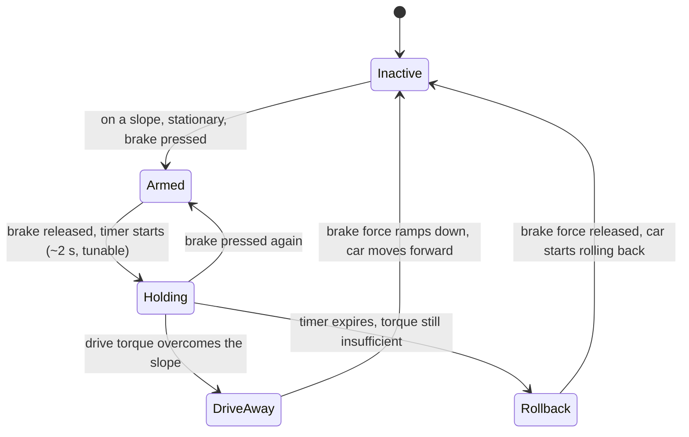
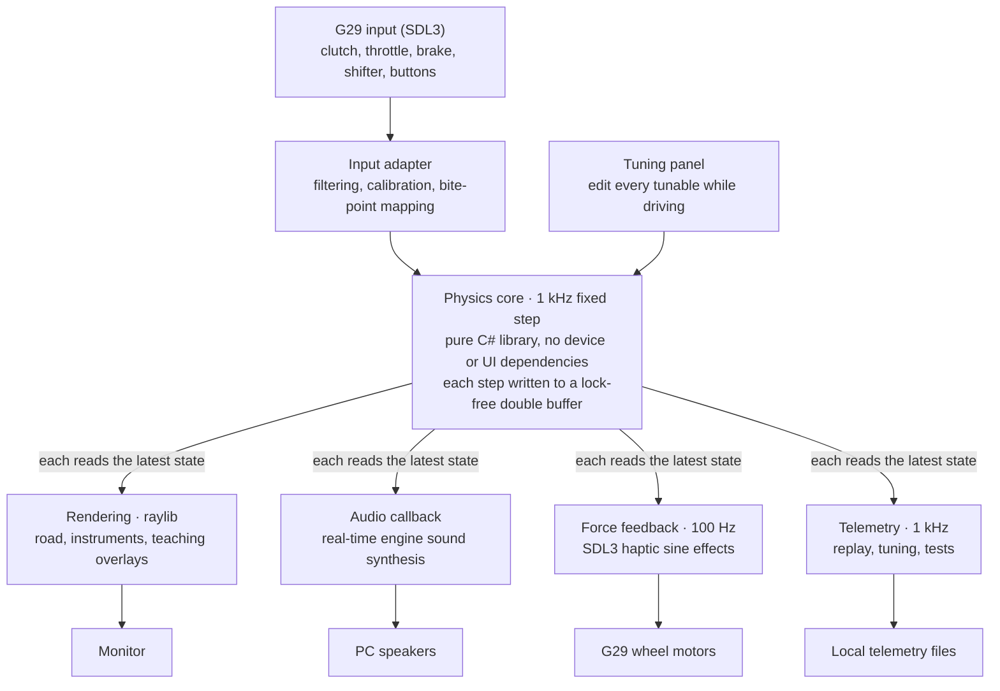

# Manual Transmission Practice Simulator v1 Design

2026-10-03 · Donghui

> English version of [`design.md`](design.md) (中文). The two files are kept in sync: every change goes into both in the same commit.

## Overview

The goal of v1: on my existing Logitech G29, reproduce the feel of my own 2019 VW Golf 110TSI manual — pulling away, hill starts, shifting, stalling and judder — to practise clutch and throttle coordination. For my own use first; others later once it matures.

Existing products are "black boxes": you stall, but you don't know why. City Car Driving's clutch is very forgiving and every car feels the same; BeamNG is mechanically accurate but has weak pedal feel; racing sims don't care about pulling away or stalling.

This project is a "glass box": clutch slip, transmitted torque, ECU compensation, how close you are to stalling — the model knows all of it, can show it live, and can replay it afterwards. That is the core difference from existing products.

## v1 scope

v1 is a straight road with an adjustable-grade uphill section and a stop line in the middle. Longitudinal control only.

| In | Out (later versions) |
| --- | --- |
| Flat pull-away, creeping, shifting, slowing down, stalling | Steering and lateral dynamics |
| Hill starts, including Golf hill-start assist (can be switched off) | Corners, intersections, traffic |
| Turbo lag and ECU idle compensation | Other car models |
| Consequences of mistakes such as gear grinding and over-revving | Real-car data logging (decided against) |
| Immersion / teaching modes, background telemetry and replay | Keyboard, gamepad or other input devices |
| Live tuning panel | Extra hardware (bass shakers etc.) |

The physics core is fully decoupled from input and output: it depends on no device or UI, so adding steering, new devices or porting to other platforms later needs no rewrite.

## Hardware and design constraints

Overall principle: v1 uses only the existing equipment; no design may depend on extra hardware.

| Device | Use | Known limits and mitigations |
| --- | --- | --- |
| G29 three pedals | Throttle, brake, clutch as three independent analog axes | Potentiometers, 8-bit (256 levels); the bite zone covers only ~50–75 levels, so low-pass filtering is required or quantisation steps cause fake judder |
| G29 wheel | v1: no steering; force feedback only, for engine judder and gear grinding. M9 adds steering on the town map | Dual-motor gear drive; periodic effects through SDL3 haptics |
| H-shifter | 6 gears + reverse | Passive lever, cannot block your hand; see shift rules below |
| Wheel buttons | Handbrake, mode switch, replay | — |
| Single monitor | Road + instrument strip at the bottom | First-time setup asks for screen width and viewing distance and computes the FOV |
| Ordinary PC speakers | Synthesised engine sound | Cannot play the 27 Hz fundamental; compensated with harmonics and modulation; first-time setup runs a sweep calibration |

Driver setup: the G29's mode switch on the back must be set to PS3 (USB PID C24F; in the PS4 position it is C260 and the axes cannot be read). Install G HUB and turn off "Combined Pedals", otherwise the clutch cannot be read; turn off the centering spring so it does not mask force feedback. The G29 firmware maps the brake in two stages: the lower 70 % of travel is about twice as sensitive as the upper 30 %; brake logic must allow for this.

Optional later upgrade: read the pedal potentiometers directly with an Arduino for 10-bit resolution. Not in v1; first confirm whether 8 bits is really the bottleneck.

## Physics model

The model is three rotating parts coupled through the clutch, plus one boost state. Stalling, judder and lugging all emerge from the physics; there are no special rules. Fixed step, 1 kHz.

**Engine.** Crank speed is driven by combustion torque minus internal friction minus the torque taken by the clutch:

```latex
J_e \dot{\omega}_e = T_{comb}(\omega_e, u, B) - T_{fric}(\omega_e) - T_{clutch}
```

Below the stall threshold there is no combustion torque; above the fuel-cut speed the ECU cuts fuel. After a stall, the ignition key drives the starter motor (torque falls linearly with speed) to restart. Friction is high near 0 rpm, representing compression resistance, so a car stalled in gear on a hill does not roll.

**Turbo lag.** Combustion torque = naturally aspirated part + boost part; boost pressure B follows its target with a time constant. At pull-away speeds (1000–1300 rpm) B is close to 0 and the engine behaves like a 1.4-litre naturally aspirated engine — that is where "not very strong" comes from.

```latex
T_{comb} = T_{NA}(\omega_e, u) + B \cdot T_{boost}(\omega_e, u), \qquad \tau_B \dot{B} = B_{target}(\omega_e, u) - B
```

**ECU idle compensation.** A PI controller targeting idle speed; the effective throttle is u = max(throttle pedal, controller output), and the torque the controller may request is capped. Releasing the clutch slowly keeps the load within the cap and the car creeps away by itself; releasing it abruptly exceeds the cap and the speed falls through the stall threshold.

**Clutch.** Pedal position maps through the bite point and bite-zone width to engagement c (0–1), which sets the maximum transmissible torque. With a speed difference across it, the clutch slips and transmits friction torque; with equal speeds it locks and transmits the torque actually needed (up to its capacity).

```latex
T_{clutch} = \begin{cases} c \, T_{c,max} \cdot \mathrm{sign}(\omega_e - \omega_t) & \text{slipping} \\ \min(|T_{req}|, \, c \, T_{c,max}) & \text{locked} \end{cases}
```

**Vehicle.** Vehicle speed is driven by clutch torque multiplied through the gear ratios, minus aerodynamic drag, rolling resistance, the gravity component along the slope, and brake and hill-hold forces:

```latex
m \dot{v} = \frac{T_{clutch} \, i_g \, i_f \, \eta}{r} - F_{aero} - F_{roll} - m g \sin\theta - F_{brake} - F_{hold}
```

**Judder.** At low speed and high load, a pulsation at firing frequency (four-cylinder four-stroke: two firings per revolution) is added to combustion torque. Its amplitude grows with load and as speed falls, with random irregularity. The same pulsation drives sound, wheel force feedback and camera shake.

### Parameters

| Parameter | Initial value | Source |
| --- | --- | --- |
| Peak torque | 250 Nm @ 1500–3500 rpm | carsales.com.au |
| Peak power | 110 kW @ 5000–6000 rpm | carsales.com.au |
| Gear ratios 1–6 / reverse | 4.11 / 2.12 / 1.36 / 0.97 / 0.77 / 0.63 / 4.0 | TrueCar (US model; Australian model to be verified) |
| Final drive | 3.39 | TrueCar (US model) |
| Mass | ~1300 kg + driver | Approximate |
| Tyres | 205/55 R16, circumference ~1.99 m | Estimate; check the tyre sidewall |
| Idle speed | ~800 rpm | Estimate, tunable |
| Idle compensation torque cap | ~120 Nm | Originally 60 Nm. M1 finding: idle speed in first gear carries ~60 Nm·s of angular momentum; 60 Nm minus friction cannot sustain T1's 2 s clutch release; T1 passes only from ~100 Nm. Tunable |
| Redline start / fuel cut | 6000 / 6800 rpm | vwvortex forum, Mk7 1.4 TSI owners (thin red line from ~6000, limiter ~6800–6900); check my own tachometer |
| Clutch max torque | ~350 Nm | Estimate (~1.4× engine peak), tunable |
| Bite point, bite-zone width | — | Tunable, by feel |
| Turbo time constant, NA torque curve | — | Tunable, by feel |
| Engine inertia, stall threshold | 0.15 kg·m², 400 rpm | M1 initial values (includes the dual-mass flywheel), tunable by feel |
| Clutch heat capacity, cooling, fade (M7) | 3000 J/K, 15 W/K; fade from 250 °C, friction down to 60 % at 350 °C; smell above 220 °C | Estimates, tunable |
| Engine heat capacity, waste heat, cooling, thermostat (M7) | 35000 J/K; waste heat = 1.9 × mechanical power; 20 W/K; 90 °C, 2000 W/K | Estimates, tunable |
| Cold-engine effects (M7) | At 0 °C internal friction +50 %, idle +300 rpm, fading linearly to none at 90 °C | Estimates, tune by feel against my own car |
| Air-con (M7) | 8 Nm load, idle +50 rpm | Estimates, tunable |

Every parameter marked "tunable" is exposed in the live tuning panel: tune while driving, then save as the Golf config file.

## Hills and hill-start assist

Uphill you must give throttle, and this follows from the physics: on a 10 % grade the engine must deliver ~30 Nm in first gear (~33 Nm including driveline efficiency) to hold the car; ~45 Nm at 15 %. In the M1 model, with no throttle and a 3 s clutch release, the car climbs a 5 % grade but stalls on 10 %. In the model a hill is just the gravity component along the road; visually the road simply rises.

Hill-start assist follows my Golf and is modelled as a brake-pressure state machine:



Release is always a ramp, never instant, or the car would jerk. Hold time, trigger grade and release rate have no exact published numbers; all are in the tuning panel and tuned to match the real car. A switch turns hill-start assist off and maps a wheel button to the handbrake, for practising traditional hill starts.

Scene: a straight road with an adjustable-grade uphill section in the middle, with a stop line halfway up.

## Shift rules

The lever is passive and cannot block your hand, so "lever position" and "gear engaged in the simulation" are two separate states.

1. **Engaging**: when clutch engagement is below a small threshold, whatever gear the lever enters is engaged. If the clutch is not pressed far enough, the lever is in gear but the simulation stays in neutral, playing a continuous grinding sound and vibrating the wheel at high frequency until the clutch is pressed and the gear really engages.
2. **Disengaging**: when the lever returns to neutral, the simulation goes to neutral immediately, regardless of the clutch. A real car is hard to pull out of gear under load, but here we choose to be lenient so lever and state never stay out of step.
3. **After the clutch is released, physics takes over**: shifting into a low gear at high speed and releasing the clutch is not prevented. The clutch drags the engine speed up, the tachometer enters the red zone, the engine screams and the car lurches. An engine-damaging mistake in a real car can be made here at zero cost.

## Feedback channels

All three channels are driven by the same physical quantities: engine speed, load, longitudinal acceleration and judder intensity.

**Visuals.** The road fills roughly the top three quarters of the screen; below is a Golf-style instrument strip (tachometer left, speedometer right, gear and shift suggestion in the middle). The sense of speed comes from optical flow at the edges of view, so evenly spaced references line the road: dashed lane lines, light poles, guard-rail posts. The "lurch" of pulling away comes mainly from the camera: it tilts back slightly when accelerating, nods back and forth when the clutch is dumped, and the whole image shakes slightly when the engine labours. The FOV is computed from the screen width and viewing distance entered at first-time setup, so the sense of speed is not trained wrong.

**Sound.** Engine sound is synthesised in real time. A four-cylinder four-stroke fires twice per revolution: ~27 Hz fundamental at 800 rpm, 200 Hz at 6000 rpm. Ordinary speakers cannot play 27 Hz, so the energy goes mainly into harmonics 2–8 and the "missing fundamental" effect lets the ear fill in the bass. Labouring is conveyed by irregular amplitude modulation of the mid and high frequencies at the firing rhythm. Turbo airflow noise is added as boost builds. First-time setup calibrates the speakers' low-frequency limit with a sweep.

**Force feedback.** The wheel carries the low-frequency part the body can feel: engine judder as a periodic sine effect whose frequency follows the firing frequency and whose amplitude follows judder intensity; gear grinding as a short high-frequency vibration; a fading shake when the car jerks (rough clutch engagement, a stall), stronger the harder the jerk. Update rate ~100 Hz.

## Immersion mode, teaching mode and replay

Immersion mode is the default; a wheel button switches to teaching mode at any time.

| | Immersion (default) | Teaching |
| --- | --- | --- |
| On screen | Only what the real instrument cluster shows: rpm, speed, gear, shift suggestion | Extra overlays at the left and right edges of the road, never in the line of sight |
| Clutch | Nothing | Clutch curve, with the bite zone and the current foot position |
| Engine | Nothing | Load bar showing how far from stalling |
| Hill-start assist | Nothing | State and remaining hold time |

**Telemetry is always recorded in the background**, regardless of mode: all inputs and model state at 1 kHz. In immersion mode, after a stall, the replay button on the wheel shows the last ten seconds of pedals, rpm and speed, so you can see exactly when you released too fast. The same telemetry is used for tuning and automated tests.

## Practice and scoring

Both ways of using it: **free driving** (drive as you like, as in v1) and **graded exercises**. An exercise only chooses the start state (position, gear, speed, handbrake) and whether hill-start assist is on; it never changes the physics. Scores are computed from the physics state of every step — the same data the replay uses.

| # | Exercise | Start | Completed when | Fails when |
| --- | --- | --- | --- | --- |
| X1 | Flat pull-away | Road start, stopped, neutral, idling | In 1st or higher, clutch locked for 1 s, ≥ 5 km/h | Stall |
| X2 | Hill start (assist) | 6 m before the stop line, handbrake on, assist on | 15 m driven uphill, 1st or higher, clutch locked | Stall, or rolls back more than 0.5 m |
| X3 | Hill start (handbrake) | Same, assist **off** | Same | Same |
| X4 | Smooth upshifts | Road start, stopped | In 3rd or higher, clutch locked, ≥ 40 km/h | Stall |
| X5 | Traffic queue (M6) | Road start, a car 3 m ahead | After the lead car's last stop, stopped behind it for 1 s | Stall, or closer than 0.5 m to the car ahead |
| X6 | Stop on the line, pull away (M6) | Road start | First stop before the stop line (front 0.5 m from it is ideal), then drive 15 m uphill, 1st or higher, clutch locked | Stall, running the line, rolling back more than 0.5 m |
| X7 | Downhill (M6) | Plateau at the top, stopped | At the bottom, 2nd or higher, clutch locked | Stall |
| X8 | Reverse uphill (M6) | Bottom of the downhill, the slope rising behind | Reverse 20 m up it, clutch locked | Stall, or rolling forward more than 0.5 m |
| X9 | Rev-matched downshift (M6) | Road start, stopped | After 45 km/h in 3rd, shift down to 2nd; 2nd, clutch locked, ≥ 20 km/h | Stall |

**Metrics** (per attempt, computed every step at 1 kHz):

| Metric | What it catches | How |
| --- | --- | --- |
| Stalls | The main failure | Combustion stops below the stall threshold (same rule as the replay). Any stall fails the attempt with 0 points |
| Clutch slip energy (kJ) | Riding the clutch, too many revs while slipping | ∫ \|clutch torque × slip angular speed\| dt — the heat the clutch absorbs |
| Peak jerk (m/s³) | Lurches: dumped clutch, harsh shifts | Longitudinal acceleration low-passed at 15 Hz, then the peak rate of change |
| Rollback (m) | Rolling back on hill starts | Furthest distance behind the start position (X2, X3) |
| Grinding (s) | Selecting a gear without the clutch fully down | Time with `Grinding` true |
| Over-rev (s) | Flaring into the red zone | Time above the redline start |
| Time (s) | Dawdling | Penalised only beyond a generous par time; rushing is never rewarded |
| Gap outside band (s, M6) | Following too close or too far | Time with the gap to the car ahead outside the comfort band (1.5–8 m) |
| Stop error (m, M6) | Stopping too far from or too close to the line | Distance of the front bumper from "0.5 m before the line" |
| Over-speed (s, M6) | Letting it run downhill | Time above the exercise's speed limit |
| Brake time (s, M6) | Holding speed on the foot brake | Time with the brake pedal above 10 % |
| Coasting (s, M6) | Rolling in neutral or with the clutch down | Time above 5 km/h in neutral or with clutch engagement below 0.5 |
| Rev mismatch (rpm, M6) | Downshifting without a blip | Slip speed across the clutch when the lower gear starts to bite |
| Downshift jerk (m/s³, M6) | The lurch on a downshift | Peak jerk from the downshift onwards (launch not counted) |

**Score** = 100 − sum of penalties. Each metric has a "good" value (no penalty), a "bad" value (full penalty) and a weight; the penalty grows linearly in between and the weights add up to 100. Grades: A ≥ 90, B ≥ 75, C ≥ 50, otherwise D. Each exercise has its own table in `config/exercises.json`, tunable in the panel. Initial values are calibrated with scripted driving: a T1-style flat pull-away with a 2 s clutch release must score at least a B.

Each attempt is appended to `scores/scores.jsonl` (not in git). The result card shows the score, grade, each metric's penalty (the biggest one names the main mistake) and the best score for that exercise; triangle still opens the replay of the attempt.

## Tech stack and runtime architecture

The stack is .NET 10 + raylib-cs + SDL3. Two selection criteria: the hard parts are physics, sound and force feedback, so the visuals only need to be adequate; and the project must be pure code, no editor, automatically testable.

| Part | Choice | Reason |
| --- | --- | --- |
| Language and runtime | C# / .NET 10 | Fast enough for 1 kHz; mature test tooling; the physics core is portable |
| Graphics and sound | raylib-cs | No editor or scene files, everything is code; the audio stream API supports real-time synthesis |
| Input and force feedback | SDL3 (input and haptic subsystems only) | raylib cannot do wheel force feedback; SDL3 uses DirectInput on Windows |

Not chosen: Unity / Godot editors and scene files are hard for an AI to work with, and their built-in physics would have to be bypassed; the Web Gamepad API can hardly do wheel force feedback.



Physics never waits for rendering: if rendering stalls, physics still advances at exactly 1 kHz. The tuning panel is the only channel that writes back into the physics core.

## Behavioural acceptance tests

There is no real-car data, so the "ground truth" is my driving experience with this Golf. Each piece of experience becomes an automated test: a script generates pedal input, runs the physics core and checks the result. No tuning may make these tests fail.

| # | Scenario | Expected result | Basis |
| --- | --- | --- | --- |
| T1 | Flat, first gear, no throttle, clutch released linearly over 2 s | No stall (rpm above the stall threshold throughout); in the last 2 s, steady at idle ±50 rpm, clutch locked, 6–7 km/h | My driving experience |
| T2 | Flat, first gear, no throttle, clutch released in 0.2 s | Engine speed falls through the stall threshold within 2 s and finally stops | Common sense; confirmed as "must stall" |
| T3 | Stationary on 10 %, first gear, clutch held down, brake held 1 s then released, no further input | Hold time within 0.1 s of the setting, car does not move during it; brake force released as a ramp; rollback starts 2–2.5 s after releasing the brake | Golf hill-start assist |
| T4 | Fourth gear at 70 km/h, clutch down, select first, release clutch over 0.5 s | Engine speed dragged into the red zone (≥ redline start); peak 100 ms mean deceleration ≥ 0.3 g | Physics reasoning. Originally "first gear 60 km/h"; see the M1 decision record below |
| T5 | Push the lever into gear without pressing the clutch | Simulation stays in neutral and grinds; gear engages once the clutch is pressed | Shift rules |
| T6 | Stationary on foot brake and handbrake, 1st gear, half throttle, clutch half way, held 90 s (M7) | The clutch starts to smell within 5–80 s; at the end its friction factor is below 0.9 and it transmits over 10 % less torque for the same pedal than at the start; the car never moves | Physics reasoning: long high-rpm slipping burns a clutch |
| T7 | Five T1-style flat pull-aways in a row (M7) | Clutch temperature rises less than 15 K, no smell, no fade | Normal pull-aways do not hurt the clutch |
| T8 | Cold engine (0 °C) idling 2 minutes, compared with a warm one (M7) | Cold idle about 300 rpm higher, temperature up more than 5 K after 2 minutes; warm idle 800 ± 50, temperature held at 89–92 °C | Cold engines idle high |
| T9 | Idle-control usage cold vs warm (M7) | Over 30 % higher when cold | Cold engines have more internal friction |
| T10 | Warm idle with the air-con on (M7) | Idle about 50 rpm higher (± 30), idle-control usage higher | The air-con is an extra load |
| T11 | Every car: steady idle; 2.5 s clutch release in 1st with no throttle does not stall; the three cars really differ (M7) | Idle ± 50 rpm; pulls away without stalling and creeps; the diesel makes over 50 Nm more net torque than the Golf at 2000 rpm, the small NA engine over 80 Nm less at 1500 rpm | Every car is drivable and has its own character |
| T12 | Steering on, 1st at 7 km/h, wheel held at 180° for 2 s (M9) | Turn radius = wheelbase / tan(wheel angle / steering ratio) within 2 %; front not sliding | Low-speed steering geometry |
| T13 | 3rd at 60 km/h, wheel at 200°, light throttle (M9) | The front slides; lateral acceleration is exactly μg | Too much lock for the speed understeers |
| T14 | 2nd at 20 km/h, wheel straight, 10 s (M9) | Heading and lateral position unchanged; the car moves on | A straight wheel goes straight |
| T15 | 3rd at 50 km/h with the wheel at 20°, 45° and 200° left, and 45° right (M9) | Aligning torque opposes the turn, larger at 45° than at 20°, smaller when sliding (200°) than at 45° | The wheel pulls back to centre and goes light at the grip limit |
| T16 | Steering off (the hill road), wheel turned 300° (M9) | The car follows the road: world X = road position, heading 0 | Steering never changes v1 behaviour |
| T17 | Steering on, 1st at 7 km/h, wheel held at ±180° (M9 follow-up) | Aligning torque towards centre ≥ 0.3 Nm, equal and opposite left and right; 0 at a standstill | The wheel returns at parking and roundabout speeds; standing still it stays put |

Every time I remember another "my car does this", add a row.

## Development milestones (proposed)

The first step is M0: one day to confirm that G29 input and force feedback both work under SDL3 — the only hardware risk in the whole stack choice. After that, each stage ends at a decidable gate; no stage starts before the previous gate is passed.

| Stage | Content | Gate |
| --- | --- | --- |
| M0 Hardware check (~1 day) | Read raw values of clutch, throttle, brake, shifter and buttons; vibrate the wheel at a given frequency and strength | The clutch is an independent analog axis, and SDL3 can drive G29 force feedback |
| M1 Physics core | Engine, turbo lag, idle compensation, clutch, vehicle, hills, hill-start assist; no UI, acceptance tests run on scripted pedal input | T1–T5 all pass |
| M2 Drivable prototype | Real pedals and shifter, 2D instruments, tuning panel, synthesised engine sound; start tuning by feel | Flat pull-away feels like my Golf |
| M3 v1 complete | 3D straight road and hill, camera shake, force-feedback judder and grinding; teaching mode, telemetry replay, first-time setup (FOV, speaker calibration) | Hill-start feel accepted; v1 done |
| M4 Practice and scoring | Graded exercises (flat pull-away, two hill starts, smooth upshifts), per-step metrics and scores, result card and score history | Scores rank my attempts the way I would, and the main deduction names the real mistake |

M2 uses 2D instruments instead of a 3D scene so the feet can get on the pedals and start tuning as early as possible; visuals come once the feel is right. No stage has a date.

The milestones after M4 (M5–M10: coaching, more exercises, fidelity and other cars, steering, sharing) and their order are in [`roadmap.en.md`](roadmap.en.md). When a milestone starts, its detailed design is written into this document.

## Open questions

- [x] How to organise practice: both — free driving plus graded exercises, see "Practice and scoring" (M4).
- [x] Scoring: stalls, clutch slip energy, peak jerk, rollback, grinding, over-rev, time; see "Practice and scoring" (M4).
- [x] T2 confirmed: treated as "must stall".
- [x] T4 conflict with physics: changed to 70 km/h, see the M1 decision record.
- [x] Redline start: kept at 6000 rpm (owner decision, not verified further).
- [x] Gear ratios: US ratios kept (owner decision, not verified further).
- [x] Tyres: kept at 205/55 R16, 1.99 m circumference (owner decision, not verified further).
- [x] Hill scene: uphill only, 10 % by default (adjustable 0–20 %), 120 m long; downhill and reversing uphill come after v1 (M3 decision F1).
- [x] Tuning panel vs main view: same window, toggled with Tab, panel on the right (M2 decision E1).
- [x] Pedal resolution: 8-bit kept, no Arduino upgrade (owner decision; feel accepted in M2 and M3).

## M1 decision record

2026-10-03, M1 completed in the cloud; all decisions below confirmed ("all suggestions accepted").

| # | Decision | Reason |
| --- | --- | --- |
| D1 | T4 scenario changed to "fourth gear 70 km/h → select first"; the original "first gear 60 km/h" was a typo | First gear cannot reach 60 km/h (~7000 rpm, above fuel cut); at 60 km/h engine and car share angular momentum by inertia and the peak is only ~5830 rpm, never reaching the red zone; at 70 km/h the peak is ~6800 rpm |
| D2 | Acceptance criteria quantified (see the acceptance test table) | The original only had qualitative descriptions; automated tests need numbers |
| D3 | Redline start 6000 rpm, fuel cut 6800 rpm | Forum owner reports, to be verified |
| D4 | Idle compensation cap 60 → 120 Nm, stall threshold 400 rpm, engine inertia 0.15 kg·m², bite point 0.8, bite-zone width 0.7, engagement exponent 2, PI gains 0.6 Nm/rpm and 2 Nm/(rpm·s) | Makes T1 and T2 pass together; feel gradient: 2 s release does not stall, 1.5 s just about, 1 s or faster stalls. Re-tune by feel in M2 |
| D5 | Friction near 0 rpm 70 Nm (compression resistance), starter stall torque 120 Nm | A car stalled in gear on 15 % does not roll; the starter must overcome compression resistance |
| D6 | Ignition input (starter) added; no combustion below the stall threshold or above fuel cut | Must be able to restart after a stall; these are ECU/physics parameters, not special-case rules |
| D7 | Torque curves store "gross torque" (friction included); tests check net torque 250 Nm @ 1500–3500 and 110 kW @ 5000–6000 | Friction modelled separately, curves still match official data |
| D8 | Hill-start assist modelled as "retained brake pressure": effective brake force = max(foot brake, retained force); hold force 5000 N, release rate 15000 N/s | Consistent with the state diagram; release as a ramp, no jerk |
| D9 | Clutch lock/slip, brakes and engine friction all use Karnopp-style static friction | No chattering under 1 ms explicit integration; friction does not push back at standstill |
| D10 | Judder randomness uses a built-in xorshift with the seed in the config | Same input gives same output, independent of the runtime's Random |
| D11 | Sim.Core only accepts JSON text (`VehicleParams.FromJson`); the caller reads files; tests read the real `config/golf-110tsi.json` | Hard rule 1: Core does no file IO; tests verify the config actually used |
| D12 | Test framework xUnit v3; `global.json` enables Microsoft.Testing.Platform | Required by `dotnet test` on the .NET 10 SDK |
| D13 | Lock-free double buffer and physics thread live in the host program (M2); Core has no threads | Hard rules 1 and 6 |

## M0 record

2026-10-03, measured locally on Windows with the G29 using `tools/HwProbe` (SDL 3.5.0, `ppy.SDL3-CS` bindings). **Gate reached**: the clutch is an independent analog axis, and SDL3 can drive G29 force feedback.

| # | Finding | Basis |
| --- | --- | --- |
| H1 | The mode switch must be in the PS3 position (PID C24F); in PS4 (PID C260) buttons read but no axis does | First run was in PS4: axes unchanged for 5 minutes; fine after switching to PS3 |
| H2 | Device: 4 axes, 25 buttons, 1 hat; haptic 1 axis, supports constant / sine / spring / damper etc., no autocenter (centering spring can only be turned off in G HUB) | `HwProbe list` |
| H3 | Axes: wheel axis 0; **clutch axis 3, throttle axis 1, brake axis 2**. Released = +32767, floored = −32768 (inverted; flip on input) | `watch`, pedal by pedal |
| H4 | The three pedals are fully independent: pressing one, the other two stay at exactly 32767 | Same, CSV checked second by second |
| H5 | Pedal resolution 8-bit: adjacent values 256 / 260 apart, 256 levels; the wheel is far finer than the pedals | CSV value-gap statistics |
| H6 | Shifter: gears 1–6 = buttons 12–17, reverse = button 18; no button in neutral | `watch` |
| H7 | Wheel buttons: X = 0, square = 1, O = 2, triangle = 3, right paddle = 4. Left paddle gives no response; v1 does not use the paddles | `watch`; X / O / square / triangle are enough for handbrake, mode switch and replay |
| H8 | Force feedback: sine effects felt at every frequency; changing frequency and magnitude live at 100 Hz is smooth, 2932 updates with 0 failures; grind buzz and stall jolt both felt | `HwProbe ffb` plus subjective feel |
| H9 | `SDL_UpdateHapticEffect` averages 0.025 ms but occasionally takes up to 8.6 ms, so force feedback must run on its own thread, not the physics thread | Same; consistent with hard rule 6 |
| H10 | Running with `--lg4ff off` and with defaults gives identical `list` output (same GUID); with G HUB installed SDL's HIDAPI LG4FF driver does not appear to take over the device. v1 uses the defaults | `HwProbe list` under both settings |
| H11 | The brake's two-stage mapping was not verified separately; revisit when the brake is wired up in M2 | — |

## M2 decision record

2026-10-03, implemented locally. **Gate reached**: driven on the G29; the flat pull-away feel is accepted with the M1 initial parameters unchanged.

| # | Decision | Reason |
| --- | --- | --- |
| E1 | Tuning panel and view share one window; Tab shows or hides the panel on the right | raylib allows one window per process; single monitor, tune while driving |
| E2 | State is passed through a lock-free **triple** buffer (`LatestValue<T>`), one per reader (rendering, audio, later force feedback and telemetry) | A double buffer either needs a lock when the reader is slow or lets it read a half-written state; a triple buffer never makes the writer wait and never tears for the reader, as hard rule 6 requires |
| E3 | The physics thread itself polls the G29 (all SDL calls on that one thread) and steps at 1 kHz against wall-clock time; if more than 50 steps behind it skips ahead and counts an overrun | SDL joystick calls must stay on one thread; physics does not wait for rendering |
| E4 | Input mapping and pedal processing live in `config/g29.json`: axis numbers, direction, end dead zones, first-order low-pass cutoff (initially 20 Hz); buttons: X = starter (hold), square = handbrake (press to toggle) | Hard rule 3; O and triangle are reserved for M3's mode switch and replay |
| E5 | Each pedal is treated as released until it first reads a non-zero value | Before the device's first report SDL returns 0 (mid travel) for every axis, and `SDL_GetJoystickAxisInitialState` also treats 0 as known; without this the car starts with half throttle and half clutch |
| E6 | The tuning panel is generated from the JSON itself: every number, boolean, array and curve point is editable. Each edit is re-parsed and validated by the real loader; on failure the old value is restored and the error shown. Ctrl+S writes back to `config/`, keeping the file's leading comments | New parameters need no panel code (hard rule 3). Curve points edit y only; x stays fixed so x remains increasing |
| E7 | The scenario grade is a constant grade; changing it restarts the car | `Road` can only be passed when constructing `Simulator`, and M2 does not change Sim.Core; the real hilly road is for M3 |
| E8 | Engine sound settings live in `config/engine-sound.json`: harmonics 1–8 of the firing frequency, energy mainly in 2–8; load affects loudness and brightness; judder modulates harmonics 3 and up randomly per firing; turbo as filtered noise; starter as a buzz | Design doc "Feedback channels / Sound"; offline render check: no NaN, silent after a stall, 1.6 ms of computation per 21 ms audio block |
| E9 | Instrument strip: tachometer, speedometer, gear (blinks and shows GRIND while grinding), stall / handbrake / hill-hold lights; above it a simple perspective road with evenly spaced posts | Get the feet on the pedals first; 3D scene and shift suggestion are for M3 |

## M3 decision record

2026-10-03, implemented locally. **Gate reached, v1 complete**: every hill start tried on the G29 (with hill-start assist, and without it using the handbrake), feel accepted.

| # | Decision | Reason |
| --- | --- | --- |
| F1 | The scene is uphill only: 150 m flat → 120 m uphill (10 % by default, adjustable 0–20 %, 15 m linear transitions at each end) → plateau; the stop line is 60 m up the hill. All in `config/scene.json`; the same grade curve builds both the physics `Road` and the 3D road | My choice; downhill and reversing uphill come after v1 |
| F2 | Two start points: R returns to the road start; H or the right paddle places the car 6 m before the stop line with the handbrake engaged | Stopped on a hill in neutral without the handbrake, the car rolls back before you can react; 6 m keeps the stop line in view |
| F3 | Buttons: O = teaching mode, triangle = replay, right paddle = hill-start position; keys T / P / H do the same, F2 = first-time setup | My choice; X = starter and square = handbrake unchanged |
| F4 | The 3D view is a render texture on the top 72 % of the window, instruments below. Camera pitch = road grade + body pitch + shake. Body pitch is a spring-damper driven by longitudinal acceleration (initially 2°/g, 1.4 Hz, damping ratio 0.35); shake is random jitter scaled by judder intensity | Not a sine of the firing phase: sampling a 27–200 Hz firing frequency at 60 fps aliases into a slow beat that looks like swaying, not judder. Coefficients in `config/camera.json` |
| F5 | Force feedback on its own 100 Hz thread, opening the haptic device by name independently (the physics thread still polls the joystick). Judder = sine at the firing frequency scaled by judder intensity; grinding = 80 Hz sine; jolt = a short constant force when longitudinal jerk exceeds a threshold, so stalls, clutch dumps and hard braking all jolt without a special "stall" rule | Hard rule 2; M0 H9. Measured over 40 s: 4005 calls, 0 failures, max 0.2 ms; physics stayed at 1000 Hz with 0 overruns. Coefficients in `config/ffb.json` |
| F6 | Telemetry: the physics thread pushes every step into a lock-free single-producer single-consumer ring (16 s of headroom; when full it drops and counts, never waits); a telemetry thread writes `telemetry/yyyyMMdd-HHmmss.bin` with field names in the header and 36 float32 per step; only the newest 20 files are kept; `telemetry/` is not in git | My choice; hard rule 6. A 13.6 s recording read back with no gaps and no drops |
| F7 | Replay: the last 10 s are kept in memory. Opening it freezes a copy and plots pedals, rpm (with stall threshold and idle marked) and speed on a shared time axis; each moment where combustion stops below the stall threshold is marked in red as a stall | Design doc: see exactly when the clutch came up too fast |
| F8 | Teaching mode: left, the clutch curve with the bite zone and the foot position; right, stall margin, idle-control usage, hill-hold state and remaining time. Sim.Core's `Clutch` became public (no behaviour change) so the overlay draws the curve the physics uses | No duplicated formula that could drift |
| F9 | Shift suggestion: with the clutch locked and the engine firing, ↑ above 2500 rpm and ↓ below 1200 rpm (`scene.json`, dashboard section), shown in both modes | Thresholds are estimates; tune to the real car's indicator |
| F10 | First-time setup: enter the visible screen width and viewing distance; the road view's vertical FOV = the angle its real height on the screen subtends at the eye. Speaker calibration is a 25 s logarithmic 20–250 Hz sweep. Harmonics below the speaker limit drop to 20 % and 60 % of the removed energy goes to the next two harmonics. Results go to `config/setup.json` (not in git); defaults in `setup.example.json` | Design doc: compute the FOV so the sense of speed is not trained wrong; speakers cannot play low frequencies. A true FOV on an ordinary monitor is narrow (about 16° for 60 cm wide at 70 cm), so the view looks more "zoomed in" than games; this is intentional |
| F11 | Pressing O (or T) while the replay is open closes the replay and turns teaching mode on, instead of toggling it underneath | Found in testing: after opening the replay with triangle, O seemed to do nothing because the replay covered the teaching overlays |

## M4 decision record

2026-10-03, implemented locally. **Gate reached**: exercises tried on the G29 and accepted ("all good"). Two fixes followed: exercises finish in the target gear or higher, and the exercise banner and result card no longer cover the teaching boxes.

| # | Decision | Reason |
| --- | --- | --- |
| G1 | An exercise only chooses the start (road start / 6 m before the stop line with the handbrake on) and the hill-start assist setting (`ExerciseSession.ApplyTo` changes only `HillHold.Enabled`); the physics is unchanged | Hard rule 2; T1–T5 unaffected |
| G2 | New project `Sim.Training` (references only Sim.Core; no IO, threads or clocks) and `Sim.Training.Tests` (runs on Linux). S1–S5 anchor the scoring with scripted driving: a 2 s flat pull-away and correct hill starts score at least B; a clutch dump and releasing the handbrake without throttle must fail; a flared launch and a grinding shift must score lower than clean ones | Scoring is not physics, so it stays out of Core; as with the acceptance tests, the tests' intent is never changed to make them pass |
| G3 | Scoring runs on the physics thread, step by step right after `Simulator.Step`; its status travels in `Frame` with an attempt id | Exact 1 kHz data and the same code as the tests; a few additions per step cannot slow the physics |
| G4 | Jerk is low-passed at 3 Hz before differentiating | At 15 Hz it mostly measured "acceleration step × 94" and could not tell 2 s, 3 s and 1.5 s clutch releases apart; at 3 Hz a smooth pull-away reads ~26 m/s³, 1.5 s ~38, an 80 % throttle flare ~87 |
| G5 | Initial tables (`config/exercises.json`): flat pull-away slip 3→30 kJ, jerk 30→90; hill starts slip 8→30 kJ, jerk 35→90, rollback 0.05→0.5 m; upshifts slip 12→40 kJ, jerk 50→120, grinding 0→0.5 s; time penalised only beyond 15 / 20 / 30 s. A stall, rollback over 0.5 m or the time limit fails the attempt with 0 points | Calibrated from scripted driving (correct hill starts ~6–7 kJ, jerk ~30, rollback < 0.05 m; a flared launch 91 kJ) |
| G6 | In the upshift exercise the peak jerk comes from the launch, not the shifts: in the model, part-throttle upshifts with roughly matched revs barely jolt, so shift quality shows mainly in slip energy and grinding | Measured: upshifts released over 0.2–1 s all read the same jerk, set by the launch |
| G7 | UI: E opens the exercise menu (keyboard or D-pad), R / H / right paddle retry, Esc returns to free driving; the result card shows each metric's penalty and "what to work on"; every result is appended to `scores/scores.jsonl` (not in git), and the best score counts completed attempts only | Usable from the wheel; the history lets progress be seen later |
| G8 | The remaining open questions keep their current values by owner decision: redline 6000 rpm, US gear ratios, 205/55 R16, 8-bit pedals without upgrade | Owner decision |

## M5 decision record (coaching I: ghost comparison and progress)

2026-10-03, implemented locally. The gate "after a bad attempt the ghost clearly shows where I differed; the progress view matches my sense of how I am doing" is pending my check on the G29.

| # | Decision | Reason |
| --- | --- | --- |
| H1 | The exercise session also receives the driver input and records a 100 Hz trace from the attempt start (clutch, throttle, brake, rpm, speed), preallocated for the time limit and handed over in the immutable result | No reallocation on the physics thread; 100 Hz shows pedal movement clearly and keeps files small |
| H2 | Ghost = the trace of each exercise's best **completed** attempt, in `scores/ghosts/<exercise>.bin`; a new best replaces it | Comparing with my own best is the most convincing; failed attempts never become ghosts |
| H3 | After an exercise, triangle (or P) replays the **whole attempt** with the ghost faintly behind it, aligned at the attempt start; in free driving it is still the last 10 s | Exercises have a clear start, so alignment is meaningful |
| H4 | "First divergence": when the clutch or throttle stays more than 0.15 of its travel from the ghost for 0.2 s, that moment gets a yellow marker and one plain sentence ("you let the clutch out sooner than in your best", etc.). Thresholds in the `coaching` section of `exercises.json` | Pointing at the single earliest difference makes it easy to fix next time |
| H5 | Progress: a new "Progress" entry in the exercise menu. Per exercise: attempts, completions, best, average of the last 5 (failures count as 0), least-squares trend over the last 10 (points per attempt), the most common issue, and a small chart of recent scores | Counting failures as 0 is honest; a trend says more about improvement than one score |
| H6 | Every history line records the "main issue" (the failure reason, or the metric that cost the most points) | The progress view counts it |
| H7 | `--screenshot` runs write telemetry and scores to a temp folder and never touch the repo's `telemetry/` or `scores/` | A test cleanup once deleted my real score history and telemetry; never again |

## M6 decision record (more practice without steering)

2026-10-03, implemented locally. The gate "each new exercise feels like the real situation and its score is fair" is pending my check on the G29.

| # | Decision | Reason |
| --- | --- | --- |
| J1 | The scene moves into `Sim.Training` and gains a downhill section after the plateau (plateau 100 m, downhill 200 m at 8 %, 15 m transitions) and named start points (road start, hill start, plateau, bottom of the downhill) | Tests use the real `scene.json`; the physics `Road` and the 3D road still come from one grade curve |
| J2 | The lead car follows a script (kinematic, not physics, cannot collide) and is used only for judging: closer than 0.5 m fails, time outside a 1.5–8 m gap costs points. After the lead's last stop, being stopped behind it completes the attempt | Exercise rules judge, they never act on the car (hard rule 2); a slow follower can still finish, just with fewer points |
| J3 | Stop line: the front bumper 0.5 m before the line is ideal; only a stop with the front within 10 m of the line counts as stopping at it; the front more than 0.5 m over the line fails ("ran the stop line"); after the stop, rollback and uphill progress count from the stop position | Waiting at the start is not stopping at the line; the chained sequence is what a real junction asks for |
| J4 | Downhill: a 50 km/h limit; time over the limit, braking (pedal above 10 %) and coasting (above 5 km/h in neutral or with engagement below 0.5) are measured | In the model 2nd gear holds 42 km/h on an 8 % slope by engine braking alone, so the right technique scores high |
| J5 | Reverse uphill: exercises have a travel direction; in reverse "rollback" means rolling forward and progress counts backwards; finishing needs reverse gear | The same metrics serve reversing |
| J6 | Rev-matched downshift: armed once 3rd reaches 45 km/h; when 2nd starts to bite (engagement above 0.1) the slip speed is recorded, and jerk is tracked separately from then on | Judges the downshift itself without the launch's jerk mixed in |
| J7 | Stopping exercises get looser jerk thresholds (queue 40→100, stop-line hill start 60→120): stopping on a slope has an unavoidable acceleration step of about 1 m/s² from gravity alone | Measured with closed-loop scripted drivers: smooth following ~54, a careful stop and pull-away on the hill ~73 |
| J8 | Calibration (closed-loop scripted driving): queue smooth 88, slow reactions 79, late braking 41; stop-line hill start ideal ~95, 2 m short ~80, heavy throttle ~70; downhill in 2nd 98, 3rd up to 55 km/h 83; reverse gentle 100, harsh 52; downshift with blip 94–99, without 52. S6–S10 (13 tests) pin these intents | As in M4, the tests' intent never changes; only `exercises.json` is tuned |
| J9 | When the window cannot be opened (e.g. a disconnected remote session with no display) the app says so and exits instead of crashing in raylib | Seen in practice: raylib init failed while the session was disconnected |

## M7 decision record (fidelity and other cars)

2026-10-03, implemented locally. The gate "the effects are noticeable but not exaggerated; the Golf still feels like the Golf; another car feels clearly different" is pending my check on the G29.

| # | Decision | Reason |
| --- | --- | --- |
| K1 | Clutch temperature: one lumped heat capacity, heated by slip power (clutch torque × slip speed) and cooling to ambient; above the fade start the friction coefficient falls linearly to a minimum and the capacity with it; above the "smell" temperature there is only a warning, no physics | Slip power is the same slip energy the scoring measures; fade shows up through clutch capacity with no special case (hard rule 2) |
| K2 | Engine temperature: waste heat proportional to mechanical combustion power warms one lumped heat capacity that cools to ambient, with strong thermostat cooling above operating temperature. Below operating temperature a "cold factor" (1 at 0 °C) adds internal friction and raises the ECU idle target | Cold engines are harder to drive and idle higher, both through the existing friction and idle-control paths |
| K3 | Air-con: a switch on the driver input; while on it adds a load torque at the crank and the ECU raises idle a little | The air-con making stalls likelier follows from the idle-control reserve |
| K4 | Engines start warm by default (`engineTempC` null = operating temperature), air-con off, clutch at ambient, so T1–T5 are unchanged; new T6–T10 cover the new effects | New physics must not change the feel already accepted |
| K5 | `startEngineTempC` in the scene (90 = warm) sets the engine temperature on every restart, for cold-start practice; C toggles the air-con | Starting cold is a scenario choice, not a property of the car |
| K6 | Other cars: a small naturally aspirated petrol (light, revvy, weak low down, no hill assist) and a 2.0 turbo diesel (heavy flywheel, strong once boosted, low redline). Plausible class figures, not specific models. The list is `config/cars.json`; V picks a car and the panel's Vehicle page switches to that car's file | Without real-car data the aim is "clearly different and plausible" |
| K7 | T11: every car must idle steadily, pull away on a 2.5 s release without stalling, and really differ. The first diesel draft stalled on a gentle pull-away for lack of torque off boost; low-rpm torque moved from the boost part to the naturally aspirated part, boosted totals unchanged | The test caught implausible parameters; the parameters changed, not the test |
| K8 | The instrument strip gains CLUTCH (smell, amber), COLD (more than 5 °C below operating temperature, blue) and A/C lights; the panel shows temperatures, clutch friction factor and idle target; telemetry gains four fields | Glass box: whatever the model knows can be seen |
| K9 | The M4 and M6 scoring needs no recalibration: warm engine and air-con off by default, and normal practice warms the clutch very little, so S1–S10 all still pass | The new effects only matter when abusing the clutch or starting cold |

## M8 decision record (exam mode and audio cues)

2026-10-03, implemented locally. The gate "the exam feels like a fair test; the cues help without nagging" is pending my check on the G29.

| # | Decision | Reason |
| --- | --- | --- |
| L1 | Exams are defined in the `exams` section of `exercises.json`: an ordered list of exercises; passed when every part completes and the average reaches the pass mark; a failed part counts as 0. A five-part "Driving test" ships (flat pull-away, stop-line hill start, queue, rev-matched downshift, reverse uphill), pass mark 70 | Like a real test: one go, no retries |
| L2 | During an exam R / H / the right paddle do nothing (no retries); after each part Enter starts the next, and after the last a summary card appears; the exam's result is recorded as `exam:<id>` in the score history and its best shows in the menu | Exams reuse the exercise sessions, scoring and history |
| L3 | Cue rules live in `config/cues.json`: a cue fires when its condition becomes true (an edge), with a cooldown per cue; it is spoken only in teaching mode (Windows speech synthesis, `System.Speech`) and shown at the bottom of the road view for 2.5 s. The rules are in the tuning panel too | Helpful without nagging; when speech is unavailable the text is still shown |
| L4 | "More throttle" uses the stall margin (< 50 rpm above stalling), not idle-control usage | Measured: in the model the idle controller saturates at 100 % even in a gentle 3 s release, so usage cannot tell good from bad; the lowest rpm can: 2 s 463, 1.5 s 406 (6 rpm above stalling), faster stalls |
| L5 | The other cues: bite point (in gear, nearly stopped, engagement above 0.05), rolling back (against the gear's direction faster than 0.1 m/s), over-rev, clutch hot | All are conditions on the physics state; the rules only decide when to speak |
| L6 | Tests: 4 for exam verdicts; 3 for cues (a gentle pull-away says only "bite point", once; a clutch dump asks for throttle; releasing the handbrake on the hill without throttle says "rolling back") | As with scoring, scripted driving pins the intent |

## M9 decision record (steering)

2026-10-03, implemented locally. The gate "driving through the roundabout and the car park feels natural on the G29, and the longitudinal feel of v1 is unchanged" is pending my check on the G29.

| # | Decision | Reason |
| --- | --- | --- |
| N1 | M9a: `HwProbe steer` updates a constant-force effect at 100 Hz with a virtual spring and damper from the wheel angle, with the judder sine on top. Result on the G29: 600 updates, 0 failures, slowest call 0.42 ms | SDL3's constant effect can carry a continuously varying steering torque |
| N2 | Lateral model: kinematic single track. Road-wheel angle = wheel angle / steering ratio (clamped to full lock); path curvature tan δ / wheelbase; lateral acceleration v²κ, capped at μg. Beyond the cap the front slides (understeer) and the yaw rate is the capped acceleration / v. No tyre slip angles, no yaw inertia | Enough for town speeds (roundabouts, parking); simple and stable at 1 kHz; the grip cap gives understeer without a tyre model to tune |
| N3 | Aligning torque = front-axle lateral force × (mechanical + pneumatic trail; the pneumatic part fades past the grip limit) × power-assist factor / steering ratio. Typical: 0.2 Nm in a tight turn at 10 km/h, 1–2.6 Nm cornering at 50–80 km/h | The wheel weights up with cornering and goes light when the front washes out, as in a real car |
| N4 | Steering is a `Simulator` option, off by default. The hill road and every test before M9 run with it off and are unchanged (T16). With it on the road is flat and the pose is world X, Y and heading | The longitudinal model is untouched; T1–T11 stay green |
| N5 | The town map is `config/town.json`: roads as straights and arcs, a roundabout (island 8 m, outer edge 16 m), a car park with 10 bays (2.6 × 5.4 m), and named start poses in the left lane. The dead end is 8 m wide. M switches free driving between the hill road and the town | One definition for drawing and judging. A Golf, with an ~11 m turning circle, cannot do a three-point turn in 6 m: the scripted turn needed 6+ legs |
| N6 | Steering input: `"steering"` in `g29.json` (axis 0, inverted, range 900°); it reaches the physics as the wheel angle in degrees, positive = left | The G HUB operating range must match `rangeDeg` |
| N7 | Steering force feedback, on the town map only: a constant force = aligning torque / `steeringFullScaleNm` (3 Nm) × `steeringGain` − `steeringDamperPerDegPerS` (0.0003) × wheel rate (filtered at 10 Hz), with judder, grinding and jolts on top as before. On the hill road the wheel stays free (spring 0) | All in `ffb.json` and the tuning panel; tune by feel |
| N8 | Town exercises: roundabout (clockwise via the west side, out of the east exit in 2nd or higher), car-park bay (2nd bay from the left, nose in within 10°, stopped), three-point turn (in the dead end, pointing south within 15°, moving in 1st). New metric `offRoadS`: time with any corner of the car's outline (`townCar` in `exercises.json`) off the road. `via` areas must be passed in order; the finish zone needs the whole car inside and is drawn in yellow | "Line keeping" is judged as time off the road; goals only judge, never act on the car |
| N9 | Tests: T12–T16 for steering physics, town map geometry tests, and S11–S13 with pure-pursuit scripted drivers: roundabout 100, anticlockwise shortcut never finishes; bay 97, wrong bay never finishes; three-point turn 86 when careful, 51 over the kerbs | As before, the tests pin the intent; `exercises.json` is tuned by feel |
| N10 | Not in M9: giving way to other traffic at the roundabout, collisions and kerb physics, camera lag on turning | Out of scope for now; leaving the road is only judged |

## M9 follow-up decision record (town test drive)

2026-10-04, after the owner's first G29 drive on the town map: the steering felt wrong and hard to hold in roundabouts, the map felt small, and there was no way to judge the car's size when parking. Also asked for: a felt jerk when the clutch engages roughly. Hand check pending.

| # | Decision | Reason |
| --- | --- | --- |
| N11 | Geometric centring (caster and kingpin inclination) added to the aligning torque: front axle load × `centringLeverM` (0.012 m) × sin(road-wheel angle), fading to 0 below `centringFullSpeedMps` (1.5 m/s). T17 | The tyre torque alone grows with v², so at 10–20 km/h it was lost in the G29's own friction and the wheel never unwound. The lever is kept small enough that the wheel still goes light past the grip limit (T15) |
| N12 | Jolts became a fading sine burst (`joltFrequencyHz` 8 Hz, fading over `joltLengthMs` 350 ms) that pushes neither way, fired at the jerk's peak and scaled linearly from `joltThresholdMps3` (30) to `joltFullScaleMps3` (400). Replaces F5's constant-force jolt | The constant force kicked the steering axis left or right on every shift, in the middle of a roundabout. Measured with the physics as it is: a rev-matched shift peaks at 15–20 m/s³, rough ones 65–430 m/s³, rising with rev mismatch and release speed, so the shake follows the engagement with no new physics (hard rule 2) |
| N13 | Steering force: `steeringFullScaleNm` 3 → 2 Nm (nearer the G29's peak) and a smoothed friction term `steeringFrictionLevel` × tanh(rate / `steeringFrictionRateDegPerS`) | A rack and column have friction; without it the motor's force alone made the wheel feel loose. The force direction was never checked while driving: the hand check does it |
| N14 | Larger town (about 1.2 × 0.7 km, about 6 km of road): every existing road and start unchanged, plus a west loop back to the start, a 1 km arterial road, a two-lane roundabout (island 18 m, outer edge 30 m), a north loop, cross streets and a second car park (40 bays). `town.json` takes arrays `roundabouts` and `carParks` (the first of each is the exercises'); `parkedBays` fill bays with cars that are not road, so touching one counts as off the road. The bays the bay exercise uses and both neighbours stay free | Room for 3rd–5th gear and for choosing routes; the exercises and S11–S13 are unchanged. `OnRoad` now uses a 20 m grid lookup so it stays cheap at 1 kHz |
| N15 | The own car's body is drawn on the car frame: bonnet (windscreen base 1.0 m ahead of the eye at 0.95 m high, nose 0.85 m high at the outline's front), dashboard and A-pillars (`camera.json` `cockpit`; width and nose from `townCar`). `lookDownDeg` (5°) rests the eyes below the horizon | With the owner's true-to-scale view (60 cm screen at 70 cm, about 20° vertical) the view reached only 10° below the horizon: the bonnet and the first 7 m of road were off-screen. The look-down turns the eyes, not the car, so the body stays where it is on the car |
| N16 | Interior and wing mirrors (F), each drawn from its own camera on the car and flipped left to right; the wing mirrors show the car's flank. A top-down inset on the town map (B, off by default) with the car's outline in yellow. The town is uploaded once as a GPU mesh so the extra views stay cheap | A driver judges position mostly from mirrors; the overhead view is an aid while learning, which you can turn off |
| N17 | ParkPilot on the town map (`config/parking.json`): four sensors per bumper (corner ones turned 30° outwards) find the first point that is not road (parked car, kerb, car-park edge); front below 10 km/h or in reverse, rear in reverse; ranges 1.2 m front / 1.5 m rear. Beeps from every 0.6 s to every 0.12 s, continuous below 0.3 m, higher tone in front; a small distance display | Like the Golf's own Park Distance Control. Pure sensor logic in `Sim.Training` with tests; sounds and display in the app |

## M10 decision record (sharing)

2026-10-03, partly implemented locally: the package and the Chinese UI. The input setup wizard for other wheels is **not** built: it exists only to support hardware other than the G29, which hard rule 5 rules out until I decide to lift it.

| # | Decision | Reason |
| --- | --- | --- |
| P1 | `scripts/publish.ps1` makes a self-contained win-x64 package (`publish/ManualSim/`, `ManualSim.exe` + `config/`, about 38 MB zipped) with the install guide `docs/install(.en).md`. `config/setup.json` is left out so first-time setup runs on the new PC; scores and telemetry are created next to `config/` | No .NET install, unzip and run; nothing personal or machine-specific is shipped |
| P2 | The UI text stays English in code. `Ui` translates every string it draws or measures through a table, `config/strings.zh.json` (English → Chinese, `{0}` placeholders for numbers and names; lines split by three spaces are translated part by part; nested parts such as failure reasons are translated too). Missing entries stay English. The tuning panel stays English | One mechanism for every screen with almost no changes to drawing code; exercise names and goals come from `exercises.json` and are translated the same way |
| P3 | In Chinese the font is DengXian (`Deng.ttf`, falling back to SimHei), loaded with ASCII plus exactly the characters used in the table. Spoken cues use a Chinese voice when Windows has one | A full CJK atlas would be huge; the table defines what can appear |
| P4 | L switches the language and saves it in `config/ui.json`; `--language zh|en` overrides it for one run | The choice survives restarts |
| P5 | Not done: the input wizard (needs hard rule 5 lifted), and the gate "a friend installs it and drives without help", which needs a friend | Waiting for my decision and a test |
