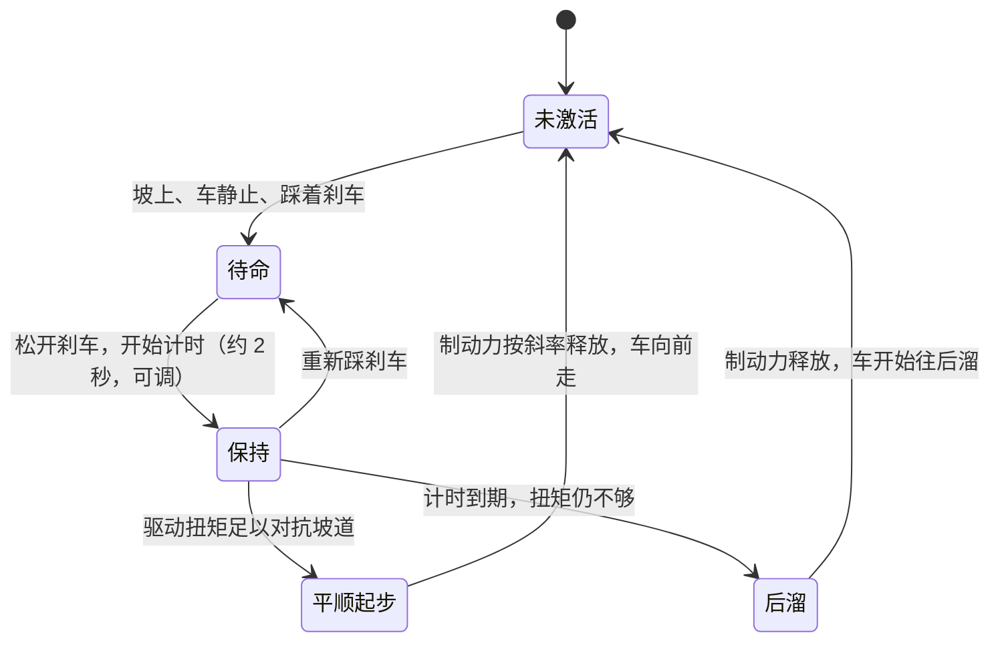
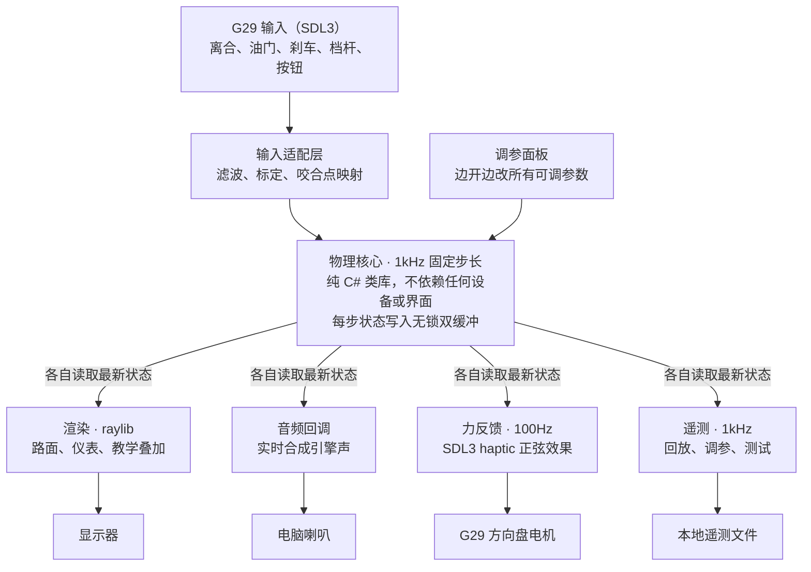

# 手动挡练习模拟器 v1 设计文档

2026-10-03 · Donghui

> 中文版。英文版见 [`design.en.md`](design.en.md)。两个文件同步维护：任何修改都在同一个提交里同时改两份。

## 项目概述

v1 的目标：在现有的 Logitech G29 上，还原我自己那台 2019 款 VW Golf 110TSI 手动挡的起步、坡起、换挡、熄火和抖动手感，用来练习离合与油门的配合。先自用，成熟后再考虑给别人用。

现有产品都是"黑盒"：你熄火了，但不知道为什么。City Car Driving 的离合很宽容且各车手感一致；BeamNG 机理准确但脚感弱；赛车类模拟器不关心起步和熄火。

本项目是"玻璃盒"：离合打滑、传递扭矩、ECU 补偿、离熄火的距离，模型内部全知道，可以实时显示，也可以事后回放。这是与现有产品的核心差别。

## v1 范围

v1 是一条笔直的公路，中间有一段可调坡度的上坡和一条停车线，只练纵向操作。

| 包含 | 不包含（后续版本） |
| --- | --- |
| 平路起步、蠕行、换挡、减速、熄火 | 转向与横向动力学 |
| 半坡起步，含 Golf 起步辅助，可关闭 | 弯道、路口、交通 |
| 涡轮迟滞与 ECU 怠速补偿 | 其他车型 |
| 打齿与超转等错误操作的后果 | 真车数据采集（已决定不做） |
| 沉浸 / 教学双模式，后台遥测与回放 | 键盘、手柄等其他输入设备 |
| 实时调参面板 | 额外硬件（低音震动器等） |

物理核心与输入、输出彻底解耦：核心不依赖任何设备或界面，以后加转向、加设备、移植平台时不需要重写。

## 硬件与设计约束

总原则：v1 只基于现有设备，任何设计都不能依赖额外硬件。

| 设备 | 用途 | 已知限制与对策 |
| --- | --- | --- |
| G29 三踏板 | 油门、刹车、离合三个独立模拟轴 | 电位器，8 位精度（256 级）；半联动区只有约 50–75 级，必须低通滤波以免量化台阶产生假抖动 |
| G29 方向盘 | 不转向，只用力反馈传递引擎抖动和打齿 | 双电机齿轮传动；通过 SDL3 haptic 发周期性效果 |
| H 档杆 | 6 档 + 倒档 | 被动档杆，挡不住手；换挡规则见下文 |
| 方向盘按钮 | 手刹、模式切换、调出回放 | — |
| 单块显示器 | 路面 + 底部仪表条 | 首次设置输入屏宽和视距，自动计算 FOV |
| 普通电脑喇叭 | 合成引擎声 | 放不出 27Hz 基频；用谐波和调制补偿，首次设置做扫频校准 |

驱动设置：G29 背面模式开关必须拨到 PS3（USB PID C24F；PS4 位置是 C260，轴读不出来）。装 G HUB，并关闭"合并踏板"，否则离合读不到；关闭中心弹簧，免得盖住力反馈。G29 固件对刹车做了两段式映射，下 70% 行程灵敏度约为上 30% 的两倍，刹车逻辑需要考虑。

后续可选升级：用 Arduino 直接读踏板电位器，精度提升到 10 位。v1 不做，先确认 8 位是否真是瓶颈。

## 物理模型

模型是三个转动部分通过离合器耦合，外加一个增压状态量；熄火、抖动、吃力全部从物理中自然产生，不写特殊规则。固定步长 1kHz。

**引擎。** 曲轴转速由燃烧扭矩减内部摩擦、再减离合传走的扭矩驱动：

```latex
J_e \dot{\omega}_e = T_{comb}(\omega_e, u, B) - T_{fric}(\omega_e) - T_{clutch}
```

转速低于熄火阈值时没有燃烧扭矩，转速高于断油转速时 ECU 断油；熄火后用点火键驱动起动机（扭矩随转速线性下降）重新打着。摩擦扭矩在 0 rpm 附近较大，代表压缩阻力，所以挂着档熄火停在坡上的车不会溜。

**涡轮迟滞。** 燃烧扭矩 = 自然吸气部分 + 增压部分，增压压力 B 带时间常数跟随目标值。起步转速（1000–1300 转）时 B 接近 0，引擎表现得像一台 1.4 升自吸小排量，这就是"不是很有力"的来源。

```latex
T_{comb} = T_{NA}(\omega_e, u) + B \cdot T_{boost}(\omega_e, u), \qquad \tau_B \dot{B} = B_{target}(\omega_e, u) - B
```

**ECU 怠速补偿。** 一个以怠速为目标的 PI 控制器，实际节气门 u = max(油门踏板, 控制器输出)，控制器能调用的扭矩有上限。慢松离合时负载在上限内，车能自己爬起来；猛松时负载超限，转速跌穿熄火阈值。

**离合器。** 踏板位置经咬合点和咬合区宽度映射为接合度 c（0–1），决定最大可传递扭矩。两侧有转速差时打滑，传递摩擦扭矩；转速一致时锁止，传递实际所需扭矩（不超过容量）。

```latex
T_{clutch} = \begin{cases} c \, T_{c,max} \cdot \mathrm{sign}(\omega_e - \omega_t) & \text{打滑} \\ \min(|T_{req}|, \, c \, T_{c,max}) & \text{锁止} \end{cases}
```

**车辆。** 车速由离合传来的扭矩经齿比放大后，减去风阻、滚阻、坡道重力分量、刹车和起步辅助的制动力：

```latex
m \dot{v} = \frac{T_{clutch} \, i_g \, i_f \, \eta}{r} - F_{aero} - F_{roll} - m g \sin\theta - F_{brake} - F_{hold}
```

**抖动。** 低转速高负载时，按点火频率（四缸四冲程，每转两次点火）对燃烧扭矩叠加脉动，幅度随负载升高、转速降低而增大，并加入随机不均匀性。这个脉动同时驱动声音、方向盘力反馈和镜头抖动。

### 参数

| 参数 | 初值 | 来源 |
| --- | --- | --- |
| 峰值扭矩 | 250 Nm @ 1500–3500 rpm | carsales.com.au |
| 最大功率 | 110 kW @ 5000–6000 rpm | carsales.com.au |
| 档位齿比 1–6 / 倒档 | 4.11 / 2.12 / 1.36 / 0.97 / 0.77 / 0.63 / 4.0 | TrueCar（美版，澳版待核实） |
| 主减速比 | 3.39 | TrueCar（美版） |
| 质量 | 约 1300 kg + 驾驶员 | 近似 |
| 轮胎 | 205/55 R16，周长约 1.99 m | 估计，待看轮胎侧壁确认 |
| 怠速 | 约 800 rpm | 估计，可调 |
| 怠速补偿扭矩上限 | 约 120 Nm | 原估 60 Nm。M1 实测：一档怠速车速对应约 60 Nm·s 的角动量，60 Nm 扣掉摩擦后撑不过 T1 的 2 秒松离合；约 100 Nm 以上 T1 才过。可调 |
| 红区起点 / 断油转速 | 6000 / 6800 rpm | vwvortex 论坛 Mk7 1.4 TSI 车主描述（细红线约 6000 起，限转约 6800–6900），待看自己的转速表确认 |
| 离合最大扭矩 | 约 350 Nm | 估计（引擎峰值的 1.4 倍左右），可调 |
| 咬合点、咬合区宽度 | — | 可调，靠脚感 |
| 涡轮时间常数、自吸扭矩曲线 | — | 可调，靠脚感 |
| 引擎转动惯量、熄火阈值 | 0.15 kg·m²、400 rpm | M1 初值（含双质量飞轮），可调，靠脚感 |

所有标"可调"的参数都暴露在实时调参面板上，边开边调，调好后存为 Golf 配置文件。

## 坡道与起步辅助

上坡必须给油，这从物理中自然得出：10% 的坡上，引擎在一档要输出约 30 Nm（计入传动效率约 33 Nm）才不溜车，15% 约 45 Nm。M1 模型里，不给油、3 秒松离合，5% 坡能爬起来，10% 坡就熄火。坡道在模型里只是重力沿路面的分量，画面上路面抬起即可。

起步辅助按我的 Golf 来做，建模为一个刹车压力状态机：



释放永远是按斜率渐进的，不是瞬间放开，否则车会顿一下。保持时长、触发坡度阈值、释放斜率都没有确切数字，全部放进调参面板按真车手感调。另有一个开关可关闭起步辅助，并把方向盘上一个按钮映射为手刹，用来练传统坡起。

场景：直路中间一段可调坡度的上坡，坡中间有一条停车线。

## 换挡规则

档杆是被动的，挡不住手，所以"档杆位置"和"模拟挂上的档"是两个独立状态。

1. **挂入**：离合接合度低于很小的阈值时，档杆进哪个档就挂哪个档。离合没踩够时，档杆在位但模拟保持空档，持续播放打齿声并让方向盘高频震动，直到离合踩下才真正挂上。
2. **摘出**：档杆回空档，模拟立即回空档，不管离合位置。真车带负载时难以摘档，但这里选择宽容，避免杆和状态长期不一致。
3. **松离合之后交给物理**：高速挂低档再松离合不会被阻止，离合会把引擎转速强行拖高，转速表进红区、引擎尖叫、车身一顿。真车上伤发动机的错误，在这里零成本地犯一次。

## 反馈通道

三个通道都由同一组物理量驱动：转速、负载、纵向加速度、抖动强度。

**画面。** 路面占屏幕上方约四分之三，下方是仿 Golf 仪表条（左转速表、右车速表、中间档位和换挡建议）。速度感来自视野边缘的光流，所以路边放等间距的参照物：虚线车道线、路灯杆、护栏桩。"起步窜一下"的感觉主要靠镜头：加速时视角轻微后仰，猛松离合时前后点头，引擎吃力时整个画面细微抖动。FOV 由首次设置的屏宽和视距自动计算，避免速度感被训练歪。

**声音。** 引擎声由代码实时合成。四缸四冲程每转点火两次，800 转时基频约 27Hz，6000 转时 200Hz。普通喇叭放不出 27Hz，所以能量主要放在第 2–8 次谐波上，利用"缺失基频"效应让耳朵自行补出低音。"吃力"靠对中高频按点火节奏做不规则幅度调制来表现。涡轮起压时叠加气流声。首次设置用扫频校准喇叭的低频下限。

**力反馈。** 方向盘承担身体能感受到的低频部分：引擎抖动用周期性正弦效果，频率跟随点火频率、幅度跟随抖动强度；打齿用短促的高频震动；熄火瞬间一下顿挫。更新频率约 100Hz。

## 沉浸模式、教学模式与回放

默认沉浸模式，方向盘上一个按钮随时切换到教学模式。

| | 沉浸模式（默认） | 教学模式 |
| --- | --- | --- |
| 屏幕信息 | 只有真车仪表上有的：转速、车速、档位、换挡建议 | 额外叠加在路面两侧边缘，不挡正前方 |
| 离合 | 无 | 离合曲线，标出咬合区和当前脚的位置 |
| 引擎 | 无 | 负载条，显示离熄火还有多远 |
| 起步辅助 | 无 | 状态和剩余保持时间 |

**遥测永远在后台记录**，与模式无关，1kHz 记录所有输入和模型状态。沉浸模式下熄火后，按方向盘上的回放键即可调出最近十秒的踏板、转速、车速曲线，看清是哪一刻松快了。同一份遥测也用于调参和自动化测试。

## 技术栈与运行时架构

技术栈是 .NET 10 + raylib-cs + SDL3。选型标准有两条：难点在物理、声音、力反馈，画面够用即可；项目必须是纯代码、无编辑器、可自动化测试。

| 部分 | 选择 | 理由 |
| --- | --- | --- |
| 语言与运行时 | C# / .NET 10 | 性能足够跑 1kHz；测试工具成熟；物理核心可带走移植 |
| 画面与声音 | raylib-cs | 没有编辑器和场景文件，一切都是代码；音频流接口支持实时合成 |
| 输入与力反馈 | SDL3（只用输入和 haptic 子系统） | raylib 做不了方向盘力反馈；SDL3 在 Windows 上走 DirectInput |

未选：Unity / Godot 的编辑器和场景文件不利于 AI 接手，且要绕过引擎自带物理；Web 的 Gamepad API 几乎做不了方向盘力反馈。



物理永远不等画面：渲染卡了，物理照样按 1kHz 精确推进。调参面板是唯一反向写入物理核心的通道。

## 行为验收测试

不采集真车数据，所以"真值"是我对这台 Golf 的驾驶经验。每条经验写成一条自动化测试：用脚本生成踏板输入，跑物理核心，检查结果。模型怎么调都不能让这些测试失败。

| # | 场景 | 期望结果 | 依据 |
| --- | --- | --- | --- |
| T1 | 平路、一档、不给油、2 秒线性松开离合 | 不熄火（全程转速高于熄火阈值）；最后 2 秒稳定在怠速 ±50 rpm、离合锁止、车速 6–7 km/h | 我的驾驶经验 |
| T2 | 平路、一档、不给油、0.2 秒松开离合 | 2 秒内转速跌穿熄火阈值，最终停转 | 常识推断，已确认按"必须熄火"执行 |
| T3 | 10% 坡道静止、一档踩住离合、踩刹车 1 秒后松开、不做任何操作 | 保持时长与设定值相差不超过 0.1 秒，期间车不动；制动力按斜率释放；松刹车后 2–2.5 秒内开始后溜 | Golf 起步辅助 |
| T4 | 四档 70 km/h 踩离合、挂一档、0.5 秒松离合 | 转速被拖入红区（≥ 红区起点）；100 ms 平均减速度峰值 ≥ 0.3 g | 物理推断。原为"一档 60 km/h"，见下方 M1 决策记录 |
| T5 | 不踩离合推档杆入档 | 模拟保持空档，触发打齿；踩下离合后挂上 | 换挡规则 |

后续每想起一条"我的车会这样"的经验，就补一行。

## 开发里程碑（提议）

第一步是 M0：用一天确认 G29 在 SDL3 下输入和力反馈都可用，这是整个选型里唯一的硬件风险。之后每个阶段以一个可判定的门槛结束，不过门槛不进入下一阶段。

| 阶段 | 内容 | 门槛 |
| --- | --- | --- |
| M0 硬件验证（约 1 天） | 读出离合、油门、刹车、档杆、按钮的原始值；让方向盘按指定频率和强度振动 | 离合是独立模拟轴，SDL3 能驱动 G29 力反馈 |
| M1 物理核心 | 引擎、涡轮迟滞、怠速补偿、离合、车辆、坡道、起步辅助；没有界面，用脚本生成的踏板输入跑验收测试 | T1–T5 全部通过 |
| M2 可以开的原型 | 接入真实踏板与档杆，2D 仪表、调参面板、合成引擎声，开始凭脚感调参 | 平路起步的脚感像我的 Golf |
| M3 v1 完整版 | 3D 直路与坡道、镜头晃动、力反馈抖动与打齿；教学模式、遥测回放、首次设置（FOV、喇叭校准） | 半坡起步手感认可，v1 完成 |

M2 先用 2D 仪表而不是 3D 场景，是为了尽快让脚踩上去调参；手感过关后再投入画面。各阶段没有定日期。

## 未决问题

- [ ] 练习怎么组织：只有自由驾驶，还是加上带评分的分项练习（平路起步、坡起、换挡平顺度）？
- [ ] 评分标准：如果有评分，用什么指标——熄火次数、离合打滑总能量、车身纵向冲击？
- [x] T2 确认：按"必须熄火"执行。
- [x] T4 与物理冲突：已改为 70 km/h，见 M1 决策记录。
- [ ] 红区起点 6000 rpm 来自论坛，看一眼自己的转速表确认。
- [ ] 澳版齿比是否与美版一致？可用"某档某车速下的转速"反推核实。
- [ ] 轮胎规格：看一眼轮胎侧壁确认。
- [x] 坡道场景：只做上坡，默认 10%（可调 0–20%），坡长 120 m；下坡和倒车上坡留到 v1 之后（M3 决策 F1）。
- [x] 调参面板与主画面的关系：同一窗口，按 Tab 切换，面板在右侧（M2 决策 E1）。
- [ ] 8 位踏板精度是否真的是瓶颈？M0 已实测确认是 256 级（见 M0 记录）；M2 凭实际手感判断，决定是否做 Arduino 升级。

## M1 决策记录

2026-10-03，M1 在云端完成，以下决定均经确认（"建议都可以接受"）。

| # | 决定 | 理由 |
| --- | --- | --- |
| D1 | T4 场景改为"四档 70 km/h → 挂一档"，原文"一档 60 km/h"是笔误 | 一档到不了 60 km/h（约 7000 rpm，超过断油）；60 km/h 时引擎与车按惯量分享角动量，峰值只有约 5830 rpm，进不了红区；70 km/h 峰值约 6800 rpm |
| D2 | 验收判据量化（见验收测试表） | 原文只有定性描述，自动化测试需要数字 |
| D3 | 红区起点 6000 rpm、断油 6800 rpm | 论坛车主描述，待核实 |
| D4 | 怠速补偿上限 60 → 120 Nm，熄火阈值 400 rpm，引擎惯量 0.15 kg·m²，咬合点 0.8、咬合区宽 0.7、接合曲线指数 2，PI 增益 0.6 Nm/rpm、2 Nm/(rpm·s) | 让 T1、T2 同时通过；手感梯度：2 秒松离合不熄火，1.5 秒勉强，1 秒及更快熄火。M2 凭脚感再调 |
| D5 | 0 rpm 附近摩擦 70 Nm（压缩阻力），起动机堵转扭矩 120 Nm | 挂档熄火停在 15% 坡上不溜；起动机必须克服压缩阻力 |
| D6 | 加入点火输入（起动机），转速低于熄火阈值无燃烧、高于断油转速无燃烧 | 熄火后要能重新打着；都是 ECU/物理参数，不是特例规则 |
| D7 | 扭矩曲线存"毛扭矩"（含摩擦），测试验证净扭矩 250 Nm @1500–3500、110 kW @5000–6000 | 摩擦单独建模，曲线仍对上官方数据 |
| D8 | 起步辅助用"保留制动压力"建模：有效制动力 = max(脚刹, 保留力)；保持力 5000 N，释放斜率 15000 N/s | 与状态图一致；释放按斜率，不会顿一下 |
| D9 | 离合锁止/打滑、刹车、引擎摩擦都用 Karnopp 式静摩擦处理 | 1 ms 显式积分下不来回抖，静止时摩擦不会反推 |
| D10 | 抖动随机数用自带 xorshift，种子在配置里 | 同样输入得到同样结果，不依赖运行时的 Random |
| D11 | Sim.Core 只接受 JSON 文本（`VehicleParams.FromJson`），读文件由调用方做；测试读真实的 `config/golf-110tsi.json` | 硬规则 1：Core 不做文件 IO；测试验证的就是实际使用的配置 |
| D12 | 测试框架 xUnit v3，`global.json` 打开 Microsoft.Testing.Platform | .NET 10 SDK 的 `dotnet test` 要求 |
| D13 | 无锁双缓冲、物理线程放到宿主程序（M2），Core 无线程 | 硬规则 1、6 |


## M0 记录

2026-10-03，本地 Windows + G29 实测，工具 `tools/HwProbe`（SDL 3.5.0，绑定 `ppy.SDL3-CS`）。**门槛达成**：离合是独立模拟轴，SDL3 能驱动 G29 力反馈。

| # | 结论 | 依据 |
| --- | --- | --- |
| H1 | 模式开关必须在 PS3 位置（PID C24F）；PS4 位置（PID C260）下按钮能读、轴全部读不出 | 第一次实测在 PS4 位置，5 分钟内轴一直不变；拨到 PS3 后正常 |
| H2 | 设备：4 轴、25 按钮、1 个 hat；haptic 1 轴，支持 constant / sine / spring / damper 等，不支持 autocenter（回中弹簧只能在 G HUB 里关） | `HwProbe list` |
| H3 | 轴：方向盘 axis 0；**离合 axis 3、油门 axis 1、刹车 axis 2**。松开 = +32767，踩到底 = −32768（方向相反，接入时取反） | `watch` 逐个踏板测试 |
| H4 | 三个踏板完全独立：单踩一个踏板时，另两个一直保持 32767 不变 | 同上，CSV 逐秒核对 |
| H5 | 踏板精度 8 位：相邻取值间隔 256 / 260，共 256 级；方向盘精度远高于踏板 | CSV 取值间隔统计 |
| H6 | 档杆：1–6 档 = 按钮 12–17，倒档 = 按钮 18；空档无按钮按下 | `watch` |
| H7 | 方向盘按钮：X = 0、方块 = 1、O = 2、三角 = 3、右拨片 = 4。左拨片没有反应，v1 不使用拨片 | `watch`；手刹、模式切换、回放用 X / O / 方块 / 三角足够 |
| H8 | 力反馈：sine 效果在各频率下都能感到；以 100 Hz 实时改频率和幅度，振动平顺，2932 次更新 0 失败；打齿短震、熄火顿挫都能感到 | `HwProbe ffb` 加主观手感 |
| H9 | `SDL_UpdateHapticEffect` 平均 0.025 ms，偶发最长 8.6 ms，所以力反馈必须放在独立线程，不能放进物理线程 | 同上；与硬规则 6 一致 |
| H10 | 用 `--lg4ff off` 和默认设置运行，`list` 输出完全一样（同一个 GUID），装 G HUB 后 SDL 的 HIDAPI LG4FF 驱动看起来没有接管设备。v1 按默认设置使用 | `HwProbe list` 两种设置对比 |
| H11 | 刹车两段式映射没有单独验证，留到 M2 接入刹车时再看 | — |

## M2 决策记录

2026-10-03，本地实现。**门槛达成**：用 G29 实际开过，平路起步的脚感认可，参数沿用 M1 的初值，没有调整。

| # | 决定 | 理由 |
| --- | --- | --- |
| E1 | 调参面板和画面在同一个窗口里，按 Tab 显示或隐藏，面板在右侧 | raylib 一个进程只能开一个窗口；单显示器，边开边调 |
| E2 | 状态传递用无锁**三**缓冲（`LatestValue<T>`），每个读方（渲染、音频，以后的力反馈、遥测）各有一份 | 双缓冲在读方慢时要么加锁、要么读到写了一半的状态；三缓冲写方永不等待、读方永不撕裂，符合硬规则 6 |
| E3 | 物理线程自己负责轮询 G29（SDL 调用都在这一个线程里），按墙钟时间以 1 kHz 补步；落后超过 50 步就跳过这一段，并计为 overrun | SDL 的手柄调用要求在同一个线程里；物理不等渲染 |
| E4 | 输入映射和踏板处理放在 `config/g29.json`：轴号、方向、两端死区、一阶低通截止频率（初值 20 Hz）；按钮：X = 起动（按住），方块 = 手刹（按一下切换） | 硬规则 3；O 和三角留给 M3 的模式切换和回放 |
| E5 | 每个踏板在读到第一个非 0 值之前都按"松开"处理 | 设备第一次报告之前，SDL 对所有轴都返回 0（行程中点），`SDL_GetJoystickAxisInitialState` 也把 0 当成已知值；不处理的话，一启动就是半油门、半离合 |
| E6 | 调参面板从 JSON 本身生成：所有数值、布尔值、数组和曲线点都能改。每次修改都交给真正的加载器重新解析和校验，失败就恢复旧值并显示错误。Ctrl+S 写回 `config/`，保留文件开头的注释 | 新增参数不用改面板代码（硬规则 3）。曲线点只改 y，x 固定，保证 x 递增 |
| E7 | 场景里的坡度是常数坡，改坡度会让车重新开始 | `Road` 只能在构造 `Simulator` 时传入，M2 不改 Sim.Core；真正的带坡道路留给 M3 |
| E8 | 引擎声参数放在 `config/engine-sound.json`：点火频率的 1–8 次谐波，能量主要在 2–8 次；负载影响响度和亮度；抖动时对 3 次及以上谐波做随机的逐次点火调制；涡轮用滤波噪声；起动机用嗡嗡声 | 设计文档"反馈通道 / 声音"；离线渲染检查：没有 NaN，熄火后静音，每 21 ms 的音频块只需 1.6 ms 计算 |
| E9 | 仪表条：转速表、车速表、档位（打齿时闪烁并显示 GRIND）、熄火 / 手刹 / 起步辅助三个指示灯；上方是简单的透视路面，路边有等间距的柱子 | 先让脚能踩起来，3D 场景和换挡建议留给 M3 |

## M3 决策记录

2026-10-03，本地实现。**门槛达成，v1 完成**：在 G29 上试了所有坡起（开着起步辅助、关掉起步辅助用手刹），手感认可。

| # | 决定 | 理由 |
| --- | --- | --- |
| F1 | 场景只有上坡：平路 150 m → 上坡 120 m（默认 10%，可调 0–20%，两端各有 15 m 线性过渡）→ 坡顶平台；停车线在坡上 60 m 处。全部写在 `config/scene.json` 里，同一条坡度曲线既生成物理的 `Road`，也生成 3D 路面 | 我选的；下坡和倒车上坡留到 v1 之后 |
| F2 | 两个起点：R 回到路的起点；H 或右拨片把车放到停车线前 6 m，并拉上手刹 | 停在坡上空档不拉手刹，人还没反应车就溜了；6 m 让停车线留在视野里 |
| F3 | 按钮：O = 教学模式，三角 = 回放，右拨片 = 坡起位置；键盘 T / P / H 作用相同，F2 = 首次设置 | 我选的；X = 起动、方块 = 手刹不变 |
| F4 | 3D 画面用 render texture 画在窗口上方 72%，仪表条在下方。相机俯仰 = 路面坡度 + 车身俯仰 + 抖动。车身俯仰用弹簧阻尼模型，由纵向加速度驱动（初值 2°/g、1.4 Hz、阻尼比 0.35）；抖动用随机抖动乘以抖动强度 | 不用点火相位的正弦：60 fps 采样 27–200 Hz 的点火频率会混叠成缓慢的"拍"，看起来像摇晃而不是抖动。系数都在 `config/camera.json` |
| F5 | 力反馈独立线程 100 Hz，按名字单独打开 haptic 设备（物理线程照旧轮询手柄）。抖动 = 点火频率的正弦乘以抖动强度；打齿 = 80 Hz 正弦；顿挫 = 纵向 jerk 超过阈值时发一个短 constant 力，熄火、猛松离合、急刹都会触发，不写"熄火"特例 | 硬规则 2；M0 H9。实测 40 秒：4005 次调用、0 失败、最长 0.2 ms，物理保持 1000 Hz、0 overrun。系数在 `config/ffb.json` |
| F6 | 遥测：物理线程把每一步推进无锁单生产者单消费者环形队列（16 秒余量，满了丢弃并计数，不等待），遥测线程写 `telemetry/yyyyMMdd-HHmmss.bin`：文件头写字段名，之后每步 36 个 float32；只保留最近 20 个文件；`telemetry/` 不进 git | 我选的；硬规则 6。实测 13.6 秒的记录读回，没有缺口、没有丢弃 |
| F7 | 回放：内存保留最近 10 秒。按下时冻结一份，画出踏板、转速（标出熄火阈值和怠速）、车速三组曲线，共用时间轴；"燃烧停止且转速低于熄火阈值"的时刻用红线标为熄火 | 设计文档：熄火后看清是哪一刻松快了 |
| F8 | 教学模式：左边是离合曲线、咬合区和脚的位置；右边是熄火余量、怠速补偿用量、起步辅助状态和剩余时间。Sim.Core 的 `Clutch` 改为 public（行为不变），叠加层画的就是物理用的那条曲线 | 不复制公式，避免两边不一致 |
| F9 | 换挡建议：离合锁止、引擎在燃烧时，高于 2500 rpm 显示 ↑，低于 1200 rpm 显示 ↓（`scene.json` 的 dashboard 段），两种模式都显示 | 阈值是估计值，按真车的换挡建议再调 |
| F10 | 首次设置：输入屏幕可视宽度和视距，路面视图的垂直 FOV = 它在屏幕上的实际高度对眼睛张开的角度；喇叭校准用 25 秒、20–250 Hz 的对数扫频。低于喇叭下限的谐波降到 20%，去掉的能量 60% 加给上面的两个谐波。结果写进 `config/setup.json`（不进 git），默认值在 `setup.example.json` | 设计文档：FOV 自动计算以免速度感被训练歪；喇叭放不出低频。真实 FOV 在普通显示器上很窄（例如 60 cm 宽、70 cm 远时约 16°），画面看起来比游戏"放大"，这是有意的 |
| F11 | 回放打开时按 O（或 T）会关掉回放并打开教学模式，而不是在回放下面切换 | 实测：先按三角看回放再按 O，教学叠加层被回放盖住，看起来"没反应" |
